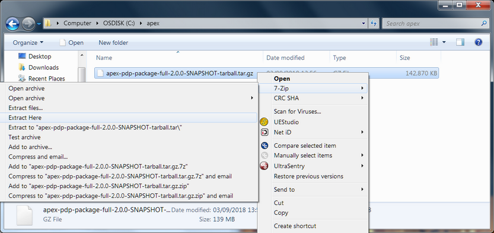
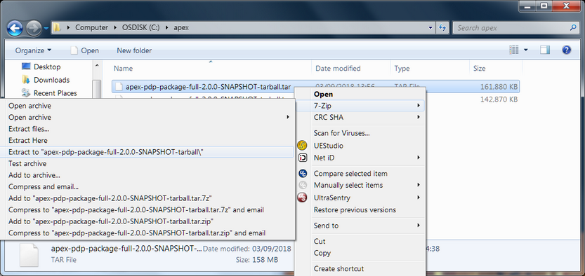
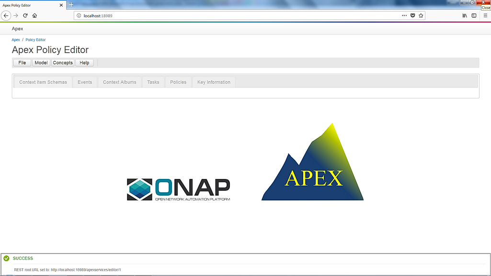
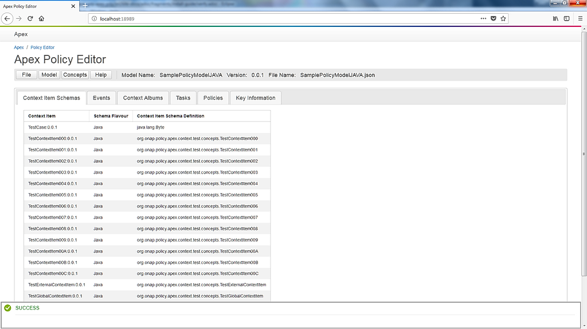

.. This work is licensed under a Creative Commons Attribution 4.0 International License.
.. http://creativecommons.org/licenses/by/4.0

APEX Installation Guide
***********************

.. contents::
    :depth: 3

Requirements
^^^^^^^^^^^^

      .. container:: sectionbody

         .. container:: paragraph

            APEX is 100% written in Java and runs on any platform that
            supports a JVM, e.g. Windows, Unix, Cygwin. Some APEX
            applications (such as the monitoring application) come as
            web archives, they do require a war-capable web server
            installed.

Installation Requirements
-------------------------

            .. container:: ulist

               -  Downloaded distribution: JAVA runtime environment
                  (JRE, Java 8 or later, APEX is tested with the Oracle
                  Java)

               -  Building from source: JAVA development kit (JDK, Java
                  8 or later, APEX is tested with the Oracle Java)

               -  A web archive capable webserver, for instance for the
                  monitoring application

                  .. container:: ulist

                     -  for instance `Apache
                        Tomcat <https://tomcat.apache.org/>`__

               -  Sufficient rights to install APEX on the system

               -  Installation tools depending on the installation
                  method used:

                  .. container:: ulist

                     -  ZIP to extract from a ZIP distribution

                        .. container:: ulist

                           -  Windows for instance
                              `7Zip <http://www.7-zip.org/>`__

                     -  TAR and GZ to extract from that TAR.GZ
                        distribution

                        .. container:: ulist

                           -  Windows for instance
                              `7Zip <http://www.7-zip.org/>`__

                     -  RPM to install from the RPM distribution

                        .. container:: ulist

                           -  Install: ``sudo apt-get install rpm``

                     -  DPKG to install from the DEB distribution

                        .. container:: ulist

                           -  Install: ``sudo apt-get install dpkg``

Feature Requirements
--------------------

            .. container:: paragraph

               APEX supports a number of features that require extra
               software being installed.

            .. container:: ulist

               -  `Apache Kafka <https://kafka.apache.org/>`__ to
                  connect APEX to a Kafka message bus

               -  `Hazelcast <https://hazelcast.com/>`__ to use
                  distributed hash maps for context

               -  `Infinispan <http://infinispan.org/>`__ for
                  distributed context and persistence

               -  `Docker <https://www.docker.com/>`__ to run APEX
                  inside a Docker container

Build (Install from Source) Requirements
----------------------------------------

            .. container:: paragraph

               Installation from source requires a few development tools

            .. container:: ulist

               -  GIT to retrieve the source code

               -  Java SDK, Java version 8 or later

               -  Apache Maven 3 (the APEX build environment)

Get the APEX Source Code
^^^^^^^^^^^^^^^^^^^^^^^^

      .. container:: sectionbody

         .. container:: paragraph

            The first APEX source code was hosted on Github in January
            2018. By the end of 2018, APEX was added as a project in the
            ONAP Policy Framework, released later in the ONAP Casablanca
            release.

         .. container:: paragraph

            The APEX source code is hosted in ONAP as project APEX. The
            current stable version is in the master branch. Simply clone
            the master branch from ONAP using HTTPS.

         .. container:: listingblock

            .. container:: content

               .. code:: bash
                  :number-lines:

                  git clone https://gerrit.onap.org/r/policy/apex-pdp

Build APEX
^^^^^^^^^^

   .. container:: sectionbody

      .. container:: paragraph

         The examples in this document assume that the APEX source
         repositories are cloned to:

      .. container:: ulist

         -  Unix, Cygwin: ``/usr/local/src/apex-pdp``

         -  Windows: ``C:\dev\apex-pdp``

         -  Cygwin: ``/cygdrive/c/dev/apex-pdp``

      .. important::
	     A Build requires ONAP Nexus
		 APEX has a dependency to ONAP parent projects. You might need to adjust your Maven M2 settings. The most current
		 settings can be found in the ONAP oparent repo: `Settings <https://git.onap.org/oparent/plain/settings.xml>`__.

      .. important::
	     A Build needs Space
		 Building APEX requires approximately 2-3 GB of hard disc space, 1 GB for the actual build with full distribution and 1-2 GB for
		 the downloaded dependencies

      .. important::
	     A Build requires Internet (for first build)
		 During the build, several (a lot) of Maven dependencies will be downloaded and stored in the configured local Maven
		 repository. The first standard build (and any first specific build) requires Internet access to download those dependencies.

      .. important::
	     Building RPM distributions
		 RPM images are only build if the ``rpm`` package is installed (Unix). To install ``rpm`` run ``sudo apt-get install rpm``, 
		 then build APEX.

      .. container:: paragraph

         Use Maven to for a standard build without any tests.

      +-------------------------------------------------------+--------------------------------------------------------+
      | Unix, Cygwin                                          | Windows                                                |
      +=======================================================+========================================================+
      | .. container::                                        | .. container::                                         |
      |                                                       |                                                        |
      |    .. container:: content                             |    .. container:: content                              |
      |                                                       |                                                        |
      |       .. code:: bash                                  |       .. code:: bash                                   |
      |         :number-lines:                                |         :number-lines:                                 |
      |                                                       |                                                        |
      |         >c:                                           |         # cd /usr/local/src/apex-pdp                   |
      |         >cd \dev\apex                                 |         # mvn clean install -DskipTest                 |
      |         >mvn clean install -DskipTests                |                                                        |
      +-------------------------------------------------------+--------------------------------------------------------+

.. container:: paragraph

   The build takes 2-3 minutes on a standard development laptop. It
   should run through without errors, but with a lot of messages from
   the build process.

.. container:: paragraph

   When Maven is finished with the build, the final screen should look
   similar to this (omitting some ``success`` lines):

.. container:: listingblock

   .. container:: content

      .. code:: bash
        :number-lines:

        [INFO] tools .............................................. SUCCESS [  0.248 s]
        [INFO] tools-common ....................................... SUCCESS [  0.784 s]
        [INFO] simple-wsclient .................................... SUCCESS [  3.303 s]
        [INFO] model-generator .................................... SUCCESS [  0.644 s]
        [INFO] packages ........................................... SUCCESS [  0.336 s]
        [INFO] apex-pdp-package-full .............................. SUCCESS [01:10 min]
        [INFO] Policy APEX PDP - Docker build 2.0.0-SNAPSHOT ...... SUCCESS [ 10.307 s]
        [INFO] ------------------------------------------------------------------------
        [INFO] BUILD SUCCESS
        [INFO] ------------------------------------------------------------------------
        [INFO] Total time: 03:43 min
        [INFO] Finished at: 2018-09-03T11:56:01+01:00
        [INFO] ------------------------------------------------------------------------

.. container:: paragraph

   The build will have created all artifacts required for an APEX
   installation. The following example show how to change to the target
   directory and how it should look like.

+----------------------------------------------------------------------------------------------------------------------------+
| Unix, Cygwin                                                                                                               |
+============================================================================================================================+
| .. container::                                                                                                             |
|                                                                                                                            |
|    .. container:: listingblock                                                                                             |
|                                                                                                                            |
|       .. container:: content                                                                                               |
|                                                                                                                            |
|          .. code:: bash                                                                                                    |
|             :number-lines:                                                                                                 |
|                                                                                                                            |
|             -rwxrwx---+ 1 esvevan Domain Users       772 Sep  3 11:55 apex-pdp-package-full_2.0.0~SNAPSHOT_all.changes*    |
|             -rwxrwx---+ 1 esvevan Domain Users 146328082 Sep  3 11:55 apex-pdp-package-full-2.0.0-SNAPSHOT.deb*            |
|             -rwxrwx---+ 1 esvevan Domain Users     15633 Sep  3 11:54 apex-pdp-package-full-2.0.0-SNAPSHOT.jar*            |
|             -rwxrwx---+ 1 esvevan Domain Users 146296819 Sep  3 11:55 apex-pdp-package-full-2.0.0-SNAPSHOT-tarball.tar.gz* |
|             drwxrwx---+ 1 esvevan Domain Users         0 Sep  3 11:54 archive-tmp/                                         |
|             -rwxrwx---+ 1 esvevan Domain Users        89 Sep  3 11:54 checkstyle-cachefile*                                |
|             -rwxrwx---+ 1 esvevan Domain Users     10621 Sep  3 11:54 checkstyle-checker.xml*                              |
|             -rwxrwx---+ 1 esvevan Domain Users       584 Sep  3 11:54 checkstyle-header.txt*                               |
|             -rwxrwx---+ 1 esvevan Domain Users        86 Sep  3 11:54 checkstyle-result.xml*                               |
|             drwxrwx---+ 1 esvevan Domain Users         0 Sep  3 11:54 classes/                                             |
|             drwxrwx---+ 1 esvevan Domain Users         0 Sep  3 11:54 dependency-maven-plugin-markers/                     |
|             drwxrwx---+ 1 esvevan Domain Users         0 Sep  3 11:54 etc/                                                 |
|             drwxrwx---+ 1 esvevan Domain Users         0 Sep  3 11:54 examples/                                            |
|             drwxrwx---+ 1 esvevan Domain Users         0 Sep  3 11:55 install_hierarchy/                                   |
|             drwxrwx---+ 1 esvevan Domain Users         0 Sep  3 11:54 maven-archiver/                                      |
+----------------------------------------------------------------------------------------------------------------------------+

+--------------------------------------------------------------------------------------------------------+
| Windows                                                                                                |
+========================================================================================================+
| .. container::                                                                                         |
|                                                                                                        |
|    .. container:: listingblock                                                                         |
|                                                                                                        |
|       .. container:: content                                                                           |
|                                                                                                        |
|          .. code:: bash                                                                                |
|             :number-lines:                                                                             |
|                                                                                                        |
|                03/09/2018  11:55    <DIR>          .                                                   |
|                03/09/2018  11:55    <DIR>          ..                                                  |
|                03/09/2018  11:55       146,296,819 apex-pdp-package-full-2.0.0-SNAPSHOT-tarball.tar.gz |
|                03/09/2018  11:55       146,328,082 apex-pdp-package-full-2.0.0-SNAPSHOT.deb            |
|                03/09/2018  11:54            15,633 apex-pdp-package-full-2.0.0-SNAPSHOT.jar            |
|                03/09/2018  11:55               772 apex-pdp-package-full_2.0.0~SNAPSHOT_all.changes    |
|                03/09/2018  11:54    <DIR>          archive-tmp                                         |
|                03/09/2018  11:54                89 checkstyle-cachefile                                |
|                03/09/2018  11:54            10,621 checkstyle-checker.xml                              |
|                03/09/2018  11:54               584 checkstyle-header.txt                               |
|                03/09/2018  11:54                86 checkstyle-result.xml                               |
|                03/09/2018  11:54    <DIR>          classes                                             |
|                03/09/2018  11:54    <DIR>          dependency-maven-plugin-markers                     |
|                03/09/2018  11:54    <DIR>          etc                                                 |
|                03/09/2018  11:54    <DIR>          examples                                            |
|                03/09/2018  11:55    <DIR>          install_hierarchy                                   |
|                03/09/2018  11:54    <DIR>          maven-archiver                                      |
|                               8 File(s)    292,652,686 bytes                                           |
|                               9 Dir(s)  14,138,720,256 bytes free                                      |
+--------------------------------------------------------------------------------------------------------+

Install APEX
^^^^^^^^^^^^

      .. container:: paragraph

         APEX can be installed in different ways:

      .. container:: ulist

         -  Unix: automatically using ``rpm`` or ``dpkg`` from ``.rpm``
            or ``.deb`` archive

         -  Windows, Unix, Cygwin: manually from a ``.tar.gz`` archive

         -  Windows, Unix, Cygwin: build from source using Maven, then
            install manually

Install with RPM and DPKG
-------------------------

         .. container:: paragraph

            The install distributions of APEX automatically install the
            system. The installation directory is
            ``/opt/app/policy/apex-pdp``. Log files are located in
            ``/var/log/onap/policy/apex-pdp``. The latest APEX version
            will be available as ``/opt/app/policy/apex-pdp/apex-pdp``.

         .. container:: paragraph

            For the installation, a new user ``apexuser`` and a new
            group ``apexuser`` will be created. This user owns the
            installation directories and the log file location. The user
            is also used by the standard APEX start scripts to run APEX
            with this user’s permissions.

         +-----------------------------------------------------------------------+
         | RPM Installation                                                      |
         +=======================================================================+
         | .. container::                                                        |
         |                                                                       |
         |    .. container:: listingblock                                        |
         |                                                                       |
         |       .. container:: content                                          |
         |                                                                       |
         |          .. code:: bash                                               |
         |             :number-lines:                                            |
         |                                                                       |
         |             # sudo rpm -i apex-pdp-package-full-2.0.0-SNAPSHOT.rpm    |
         |             ********************preinst*******************            |
         |             arguments 1                                               |
         |             **********************************************            |
         |             creating group apexuser . . .                             |
         |             creating user apexuser . . .                              |
         |             ********************postinst****************              |
         |             arguments 1                                               |
         |             ***********************************************           |
         +-----------------------------------------------------------------------+

+--------------------------------------------------------------------------------------+
| DPKG Installation                                                                    |
+======================================================================================+
| .. container::                                                                       |
|                                                                                      |
|    .. container:: listingblock                                                       |
|                                                                                      |
|       .. container:: content                                                         |
|                                                                                      |
|          .. code:: bash                                                              |
|             :number-lines:                                                           | 
|                                                                                      |
|             # sudo dpkg -i apex-pdp-package-full-2.0.0-SNAPSHOT.deb                  |            
|             Selecting previously unselected package apex-uservice.                   |
|             (Reading database ... 288458 files and directories currently installed.) |
|             Preparing to unpack apex-pdp-package-full-2.0.0-SNAPSHOT.deb ...         |
|             ********************preinst*******************                           |
|             arguments install                                                        |
|             **********************************************                           |
|             creating group apexuser . . .                                            |
|             creating user apexuser . . .                                             |
|             Unpacking apex-uservice (2.0.0-SNAPSHOT) ...                             |
|             Setting up apex-uservice (2.0.0-SNAPSHOT) ...                            |
|             ********************postinst****************                             |
|             arguments configure                                                      |
|             ***********************************************                          |
+--------------------------------------------------------------------------------------+

.. container:: paragraph

   Once the installation is finished, APEX is fully installed and ready
   to run.

Install Manually from Archive (Unix, Cygwin)
--------------------------------------------

   .. container:: paragraph

      Download a ``tar.gz`` archive. Create a directory where APEX
      should be installed. Extract the ``tar`` archive. The following
      example shows how to install APEX in ``/opt/apex`` and create a
      link to ``/opt/apex/apex`` for the most recent installation.

   .. container:: listingblock

      .. container:: content

         .. code:: bash
            :number-lines:

            # cd /opt
            # mkdir apex
            # cd apex
            # mkdir apex-full-2.0.0-SNAPSHOT
            # tar xvfz ~/Downloads/apex-pdp-package-full-2.0.0-SNAPSHOT.tar.gz -C apex-full-2.0.0-SNAPSHOT
            # ln -s apex apex-pdp-package-full-2.0.0-SNAPSHOT

Install Manually from Archive (Windows, 7Zip, GUI)
--------------------------------------------------

   .. container:: paragraph

      Download a ``tar.gz`` archive and copy the file into the install
      folder (in this example ``C:\apex``). Assuming you are using 7Zip,
      right click on the file and extract the ``tar`` archive. Note: the
      screenshots might show an older version than you have.

   .. container:: imageblock

      .. container:: content

         |Extract the TAR archive|
	  
   .. container:: paragraph

      The right-click on the new created TAR file and extract the actual
      APEX distribution.

   .. container:: imageblock

      .. container:: content

         |Extract the APEX distribution|

   .. container:: paragraph

      Inside the new APEX folder you see the main directories: ``bin``,
      ``etc``, ``examples``, ``lib``, and ``war``

   .. container:: paragraph

      Once extracted, please rename the created folder to
      ``apex-full-2.0.0-SNAPSHOT``. This will keep the directory name in
      line with the rest of this documentation.

Install Manually from Archive (Windows, 7Zip, CMD)
--------------------------------------------------

   .. container:: paragraph

      Download a ``tar.gz`` archive and copy the file into the install
      folder (in this example ``C:\apex``). Start ``cmd``, for instance
      typing ``Windows+R`` and then ``cmd`` in the dialog. Assuming
      ``7Zip`` is installed in the standard folder, simply run the
      following commands (for APEX version 2.0.0-SNAPSHOT full
      distribution)

   .. container:: listingblock

      .. container:: content

         .. code:: bash
           :number-lines:

            >c:
            >cd \apex
            >"\Program Files\7-Zip\7z.exe" x apex-pdp-package-full-2.0.0-SNAPSHOT.tar.gz -so | "\Program Files\7-Zip\7z.exe" x -aoa -si -ttar -o"apex-full-2.0.0-SNAPSHOT"

.. container:: paragraph

   APEX is now installed in the folder
   ``C:\apex\apex-full-2.0.0-SNAPSHOT``.

Build from Source
^^^^^^^^^^^^^^^^^

Build and Install Manually (Unix, Windows, Cygwin)
--------------------------------------------------

         .. container:: paragraph

            Clone the APEX GIT repositories into a directory. Go to that
            directory. Use Maven to build APEX (all details on building
            APEX from source can be found in *APEX HowTo: Build*).
            Install from the created artifacts (``rpm``, ``deb``,
            ``tar.gz``, or copying manually).

         .. important:: 
		    Building RPM distributions
			RPM images are only build if the ``rpm`` package is installed (Unix). To install ``rpm`` run ``sudo apt-get install rpm``, 
			then build APEX.

         .. container:: paragraph

            The following example shows how to build the APEX system,
            without tests (``-DskipTests``) to safe some time. It
            assumes that the APX GIT repositories are cloned to:

         .. container:: ulist

            -  Unix, Cygwin: ``/usr/local/src/apex``

            -  Windows: ``C:\dev\apex``

    	 +-------------------------------------------------------+--------------------------------------------------------+
         | Unix, Cygwin                                          | Windows                                                |
         +=======================================================+========================================================+
         | .. container::                                        | .. container::                                         |
         |                                                       |                                                        |
         |    .. container:: content                             |    .. container:: content                              |
         |                                                       |                                                        |
         |       .. code:: bash                                  |       .. code:: bash                                   |
         |         :number-lines:                                |         :number-lines:                                 |
         |                                                       |                                                        |
         |         >c:                                           |         # cd /usr/local/src/apex                       |
         |         >cd \dev\apex                                 |         # mvn clean install -DskipTests                |
         |         >mvn clean install -DskipTests                |                                                        |
         +-------------------------------------------------------+--------------------------------------------------------+

.. container:: paragraph

   The build takes about 2 minutes without test and about 4-5 minutes
   with tests on a standard development laptop. It should run through
   without errors, but with a lot of messages from the build process. If
   build with tests (i.e. without ``-DskipTests``), there will be error
   messages and stack trace prints from some tests. This is normal, as
   long as the build finishes successful.

.. container:: paragraph

   When Maven is finished with the build, the final screen should look
   similar to this (omitting some ``success`` lines):

.. container:: listingblock

   .. container:: content

      .. code:: bash
         :number-lines:

         [INFO] tools .............................................. SUCCESS [  0.248 s]
         [INFO] tools-common ....................................... SUCCESS [  0.784 s]
         [INFO] simple-wsclient .................................... SUCCESS [  3.303 s]
         [INFO] model-generator .................................... SUCCESS [  0.644 s]
         [INFO] packages ........................................... SUCCESS [  0.336 s]
         [INFO] apex-pdp-package-full .............................. SUCCESS [01:10 min]
         [INFO] Policy APEX PDP - Docker build 2.0.0-SNAPSHOT ...... SUCCESS [ 10.307 s]
         [INFO] ------------------------------------------------------------------------
         [INFO] BUILD SUCCESS
         [INFO] ------------------------------------------------------------------------
         [INFO] Total time: 03:43 min
         [INFO] Finished at: 2018-09-03T11:56:01+01:00
         [INFO] ------------------------------------------------------------------------

.. container:: paragraph

   The build will have created all artifacts required for an APEX
   installation. The following example show how to change to the target
   directory and how it should look like.

+-----------------------------------------------------------------------------------------------------------------------------+
| Unix, Cygwin                                                                                                                |
+=============================================================================================================================+
| .. container::                                                                                                              |
|                                                                                                                             |
|    .. container:: listingblock                                                                                              |
|                                                                                                                             |
|          .. code:: bash                                                                                                     |
|            :number-lines:                                                                                                   |
|                                                                                                                             |
|            # cd packages/apex-pdp-package-full/target                                                                       |
|            # ls -l                                                                                                          |
|            -rwxrwx---+ 1 esvevan Domain Users       772 Sep  3 11:55 apex-pdp-package-full_2.0.0~SNAPSHOT_all.changes*      |
|            -rwxrwx---+ 1 esvevan Domain Users 146328082 Sep  3 11:55 apex-pdp-package-full-2.0.0-SNAPSHOT.deb*              |
|            -rwxrwx---+ 1 esvevan Domain Users     15633 Sep  3 11:54 apex-pdp-package-full-2.0.0-SNAPSHOT.jar*              |
|            -rwxrwx---+ 1 esvevan Domain Users 146296819 Sep  3 11:55 apex-pdp-package-full-2.0.0-SNAPSHOT-tarball.tar.gz*   |
|            drwxrwx---+ 1 esvevan Domain Users         0 Sep  3 11:54 archive-tmp/                                           |
|            -rwxrwx---+ 1 esvevan Domain Users        89 Sep  3 11:54 checkstyle-cachefile*                                  |
|            -rwxrwx---+ 1 esvevan Domain Users     10621 Sep  3 11:54 checkstyle-checker.xml*                                |
|            -rwxrwx---+ 1 esvevan Domain Users       584 Sep  3 11:54 checkstyle-header.txt*                                 |
|            -rwxrwx---+ 1 esvevan Domain Users        86 Sep  3 11:54 checkstyle-result.xml*                                 |
|            drwxrwx---+ 1 esvevan Domain Users         0 Sep  3 11:54 classes/                                               |
|            drwxrwx---+ 1 esvevan Domain Users         0 Sep  3 11:54 dependency-maven-plugin-markers/                       |
|            drwxrwx---+ 1 esvevan Domain Users         0 Sep  3 11:54 etc/                                                   |
|            drwxrwx---+ 1 esvevan Domain Users         0 Sep  3 11:54 examples/                                              |
|            drwxrwx---+ 1 esvevan Domain Users         0 Sep  3 11:55 install_hierarchy/                                     |
|            drwxrwx---+ 1 esvevan Domain Users         0 Sep  3 11:54 maven-archiver/                                        |
+-----------------------------------------------------------------------------------------------------------------------------+

+-----------------------------------------------------------------------------------------------------------------------------+
| Windows                                                                                                                     |
+=============================================================================================================================+
| .. container::                                                                                                              |
|                                                                                                                             |
|    .. container:: listingblock                                                                                              |
|                                                                                                                             |
|          .. code:: bash                                                                                                     |
|            :number-lines:                                                                                                   |
|                                                                                                                             |
|            >cd packages\apex-pdp-package-full\target                                                                        |
|            >dir                                                                                                             |
|            03/09/2018  11:55    <DIR>          .                                                                            |
|            03/09/2018  11:55    <DIR>          ..                                                                           |
|            03/09/2018  11:55       146,296,819 apex-pdp-package-full-2.0.0-SNAPSHOT-tarball.tar.gz                          |
|            03/09/2018  11:55       146,328,082 apex-pdp-package-full-2.0.0-SNAPSHOT.deb                                     |
|            03/09/2018  11:54            15,633 apex-pdp-package-full-2.0.0-SNAPSHOT.jar                                     |
|            03/09/2018  11:55               772 apex-pdp-package-full_2.0.0~SNAPSHOT_all.changes                             |
|            03/09/2018  11:54    <DIR>          archive-tmp                                                                  |
|            03/09/2018  11:54                89 checkstyle-cachefile                                                         |
|            03/09/2018  11:54            10,621 checkstyle-checker.xml                                                       |
|            03/09/2018  11:54               584 checkstyle-header.txt                                                        |
|            03/09/2018  11:54                86 checkstyle-result.xml                                                        |
|            03/09/2018  11:54    <DIR>          classes                                                                      |
|            03/09/2018  11:54    <DIR>          dependency-maven-plugin-markers                                              |
|            03/09/2018  11:54    <DIR>          etc                                                                          |
|            03/09/2018  11:54    <DIR>          examples                                                                     |
|            03/09/2018  11:55    <DIR>          install_hierarchy                                                            |
|            03/09/2018  11:54    <DIR>          maven-archiver                                                               |
|                           8 File(s)    292,652,686 bytes                                                                    |
|                           9 Dir(s)  14,138,720,256 bytes free                                                               |
+-----------------------------------------------------------------------------------------------------------------------------+

.. container:: paragraph

   Now, take the ``.deb`` or the ``.tar.gz`` file and install APEX.
   Alternatively, copy the content of the folder ``install_hierarchy``
   to your APEX directory.

Installation Layout
^^^^^^^^^^^^^^^^^^^

      .. container:: paragraph

         A full installation of APEX comes with the following layout.

      .. container:: listingblock

         .. container:: content

            ::

               $APEX_HOME
                   ├───bin             (1)
                   ├───etc             (2)
                   │   ├───editor
                   │   ├───hazelcast
                   │   ├───infinispan
                   │   └───META-INF
                   ├───examples            (3)
                   │   ├───config          (4)
                   │   ├───docker          (5)
                   │   ├───events          (6)
                   │   ├───html            (7)
                   │   ├───models          (8)
                   │   └───scripts         (9)
                   ├───lib             (10)
                   │   └───applications        (11)
                   └───war             (12)

      .. container:: colist arabic

         +-----------------------------------+-----------------------------------+
         | **1**                             | binaries, mainly scripts (bash    |
         |                                   | and bat) to start the APEX engine |
         |                                   | and applications                  |
         +-----------------------------------+-----------------------------------+
         | **2**                             | configuration files, such as      |
         |                                   | logback (logging) and third party |
         |                                   | library configurations            |
         +-----------------------------------+-----------------------------------+
         | **3**                             | example policy models to get      |
         |                                   | started                           |
         +-----------------------------------+-----------------------------------+
         | **4**                             | configurations for the examples   |
         |                                   | (with sub directories for         |
         |                                   | individual examples)              |
         +-----------------------------------+-----------------------------------+
         | **5**                             | Docker files and additional       |
         |                                   | Docker instructions for the       |
         |                                   | exampples                         |
         +-----------------------------------+-----------------------------------+
         | **6**                             | example events for the examples   |
         |                                   | (with sub directories for         |
         |                                   | individual examples)              |
         +-----------------------------------+-----------------------------------+
         | **7**                             | HTML files for some examples,     |
         |                                   | e.g. the Decisionmaker example    |
         +-----------------------------------+-----------------------------------+
         | **8**                             | the policy models, generated for  |
         |                                   | each example (with sub            |
         |                                   | directories for individual        |
         |                                   | examples)                         |
         +-----------------------------------+-----------------------------------+
         | **9**                             | additional scripts for the        |
         |                                   | examples (with sub directories    |
         |                                   | for individual examples)          |
         +-----------------------------------+-----------------------------------+
         | **10**                            | the library folder with all Java  |
         |                                   | JAR files                         |
         +-----------------------------------+-----------------------------------+
         | **11**                            | applications, also known as jar   |
         |                                   | with dependencies (or fat jars),  |
         |                                   | individually deployable           |
         +-----------------------------------+-----------------------------------+
         | **12**                            | WAR files for web applications    |
         +-----------------------------------+-----------------------------------+

System Configuration
^^^^^^^^^^^^^^^^^^^^

      .. container:: paragraph

         Once APEX is installed, a few configurations need to be done:

      .. container:: ulist

         -  Create an APEX user and an APEX group (optional, if not
            installed using RPM and DPKG)

         -  Create environment settings for ``APEX_HOME`` and
            ``APEX_USER``, required by the start scripts

         -  Change settings of the logging framework (optional)

         -  Create directories for logging, required (execution might
            fail if directories do not exist or cannot be created)

APEX User and Group
-------------------

         .. container:: paragraph

            On smaller installations and test systems, APEX can run as
            any user or group.

         .. container:: paragraph

            However, if APEX is installed in production, we strongly
            recommend you set up a dedicated user for running APEX. This
            will isolate the execution of APEX to that user. We
            recommend you use the userid ``apexuser`` but you may use
            any user you choose.

         .. container:: paragraph

            The following example, for UNIX, creates a group called
            ``apexuser``, an APEX user called ``apexuser``, adds the
            group to the user, and changes ownership of the APEX
            installation to the user. Substitute ``<apex-dir>`` with the
            directory where APEX is installed.

         .. container:: listingblock

            .. container:: content

               .. code:: bash
                  :number-lines:

                  # sudo groupadd apexuser
                  # sudo useradd -g apexuser apexuser
                  # sudo chown -R apexuser:apexuser <apex-dir>

.. container:: paragraph

   For other operating systems please consult your manual or system
   administrator.

Environment Settings: APEX_HOME and APEX_USER
---------------------------------------------

   .. container:: paragraph

      The provided start scripts for APEX require two environment
      variables being set:

   .. container:: ulist

      -  ``APEX_USER`` with the user under whos name and permission APEX
         should be started (Unix only)

      -  ``APEX_HOME`` with the directory where APEX is installed (Unix,
         Windows, Cygwin)

   .. container:: paragraph

      The first row in the following table shows how to set these
      environment variables temporary (assuming the user is
      ``apexuser``). The second row shows how to verify the settings.
      The last row explains how to set those variables permanently.

   +------------------------------------------------+---------------------------------------------------------+
   | Unix, Cygwin (bash/tcsh)                       | Windows                                                 |
   +================================================+=========================================================+
   | .. container::                                 | .. container::                                          |
   |                                                |                                                         |
   |    .. container:: content                      |    .. container:: content                               |
   |                                                |                                                         |
   |       .. code:: bash                           |       .. code:: bash                                    |
   |          :number-lines:                        |         :number-lines:                                  |
   |                                                |                                                         |
   |          # export APEX_USER=apexuser           |         >set APEX_HOME=C:\apex\apex-full-2.0.0-SNAPSHOT |
   |          # cd /opt/app/policy/apex-pdp         |                                                         |
   |          # export APEX_HOME=`pwd`              |                                                         | 
   |                                                |                                                         |
   +------------------------------------------------+                                                         |
   | .. container::                                 |                                                         |
   |                                                |                                                         |
   |    .. container:: content                      |                                                         |
   |                                                |                                                         |
   |       .. code:: tcsh                           |                                                         |
   |          :number-lines:                        |                                                         |
   |                                                |                                                         |
   |          # setenv APEX_USER apexuser           |                                                         |
   |          # cd /opt/app/policy/apex-pdp         |                                                         |
   |          # setenv APEX_HOME `pwd`              |                                                         | 
   |                                                |                                                         |
   +------------------------------------------------+---------------------------------------------------------+
   | .. container::                                 | .. container::                                          |
   |                                                |                                                         |
   |    .. container:: content                      |    .. container:: content                               |
   |                                                |                                                         |
   |       .. code:: bash                           |       .. code:: bash                                    |
   |          :number-lines:                        |          :number-lines:                                 |
   |                                                |                                                         |
   |          # env | grep APEX                     |          >set APEX_HOME                                 |
   |          # APEX_USER=apexuser                  |          APEX_HOME=\apex\apex-full-2.0.0-SNAPSHOT       |
   |          # APEX_HOME=/opt/app/policy/apex-pdp  |                                                         | 
   |                                                |                                                         |
   +------------------------------------------------+---------------------------------------------------------+

Making Environment Settings Permanent (Unix, Cygwin)
####################################################

   .. container:: paragraph

      For a per-user setting, edit the a user’s ``bash`` or ``tcsh``
      settings in ``~/.bashrc`` or ``~/.tcshrc``. For system-wide
      settings, edit ``/etc/profiles`` (requires permissions).

Making Environment Settings Permanent (Windows)
###############################################

   .. container:: paragraph

      On Windows 7 do

   .. container:: ulist

      -  Click on the **Start** Menu

      -  Right click on **Computer**

      -  Select **Properties**

   .. container:: paragraph

      On Windows 8/10 do

   .. container:: ulist

      -  Click on the **Start** Menu

      -  Select **System**

   .. container:: paragraph

      Then do the following

   .. container:: ulist

      -  Select **Advanced System Settings**

      -  On the **Advanced** tab, click the **Environment Variables**
         button

      -  Edit an existing variable, or create a new System variable:
         'Variable name'="APEX_HOME", 'Variable
         value'="C:\apex\apex-full-2.0.0-SNAPSHOT"

   .. container:: paragraph

      For the settings to take effect, an application needs to be
      restarted (e.g. any open ``cmd`` window).

Edit the APEX Logging Settings
------------------------------

   .. container:: paragraph

      Configure the APEX logging settings to your requirements, for
      instance:

   .. container:: ulist

      -  change the directory where logs are written to, or

      -  change the log levels

   .. container:: paragraph

      Edit the file ``$APEX_HOME/etc/logback.xml`` for any required
      changes. To change the log directory change the line

   .. container:: paragraph

      ``<property name="VAR_LOG" value="/var/log/onap/policy/apex-pdp/" />``

   .. container:: paragraph

      to

   .. container:: paragraph

      ``<property name="VAR_LOG" value="/PATH/TO/LOG/DIRECTORY/" />``

   .. container:: paragraph

      On Windows, it is recommended to change the log directory to:

   .. container:: paragraph

      ``<property name="VAR_LOG" value="C:/apex/apex-full-2.0.0-SNAPSHOT/logs" />``

   .. container:: paragraph

      Note: Be careful about when to use ``\`` vs. ``/`` as the path
      separator!

Create Directories for Logging
------------------------------

   .. container:: paragraph

      Make sure that the log directory exists. This is important when
      APEX was installed manually or when the log directory was changed
      in the settings (see above).
	  
   +------------------------------------------------------------------+-------------------------------------------------------+
   | Unix, Cygwin                                                     | Windows                                               |
   +==================================================================+=======================================================+
   | .. container::                                                   | .. container::                                        |
   |                                                                  |                                                       |
   |    .. container:: content                                        |    .. container:: content                             |
   |                                                                  |                                                       |
   |       .. code:: bash                                             |       .. code:: bash                                  |
   |         :number-lines:                                           |         :number-lines:                                |
   |                                                                  |                                                       |
   |         mkdir -p /var/log/onap/policy/apex-pdp                   |         >mkdir C:\apex\apex-full-2.0.0-SNAPSHOT\logs  |
   |         chown -R apexuser:apexuser /var/log/onap/policy/apex-pdp |                                                       |
   +------------------------------------------------------------------+-------------------------------------------------------+

Verify the APEX Installation
############################

   .. container:: sectionbody

      .. container:: paragraph

         When APEX is installed and all settings are realized, the
         installation can be verified.

Verify Installation - run Engine
--------------------------------

         .. container:: paragraph

            A simple verification of an APEX installation can be done by
            simply starting the APEX engine without any configuration.
            On Unix (or Cygwin) start the engine using
            ``$APEX_HOME/bin/apexEngine.sh``. On Windows start the
            engine using ``%APEX_HOME%\bin\apexEngine.bat``. The engine
            will fail to fully start. However, if the output looks
            similar to the following line, the APEX installation is
            realized.

         .. container:: listingblock

            .. container:: content

               .. code:: bash
                  :number-lines:

                  Starting Apex service with parameters [] . . .
                  start of Apex service failed: Apex configuration file was not specified as an argument
                  2018-09-03 13:11:33,914 Apex [main] ERROR o.o.p.a.service.engine.main.ApexMain - start of Apex service failed
                  org.onap.policy.apex.model.basicmodel.concepts.ApexException: Apex configuration file was not specified as an argument
                          at org.onap.policy.apex.service.engine.main.ApexCommandLineArguments.validateReadableFile(ApexCommandLineArguments.java:267)
                          at org.onap.policy.apex.service.engine.main.ApexCommandLineArguments.validate(ApexCommandLineArguments.java:161)
                          at org.onap.policy.apex.service.engine.main.ApexMain.<init>(ApexMain.java:68)
                          at org.onap.policy.apex.service.engine.main.ApexMain.main(ApexMain.java:165)
                  usage: org.onap.policy.apex.service.engine.main.ApexMain [options...]
                  options
                  -c,--config-file <CONFIG_FILE>the full path to the configuration file to use, the configuration file must be a Json file
                                                containing the Apex configuration parameters
                  -h,--help                     outputs the usage of this command
                  -m,--model-file <MODEL_FILE>  the full path to the model file to use, if set it overrides the model file set in the
                                                configuration file
                  -v,--version                  outputs the version of Apex

Verify Installation - run an Example
------------------------------------

   .. container:: paragraph

      A full APEX installation comes with several examples. Here, we can
      fully verify the installation by running one of the examples.

   .. container:: paragraph

      We use the example called *SampleDomain* and configure the engine
      to use standard in and standard out for events. Run the engine
      with the provided configuration. Note: Cygwin executes scripts as
      Unix scripts but runs Java as a Windows application, thus the
      configuration file must be given as a Windows path.

   .. container:: listingblock

      .. container:: content

         .. code:: bash
                :number-lines:

 	        # $APEX_HOME/bin/apexEngine.sh -c $APEX_HOME/examples/config/SampleDomain/Stdin2StdoutJsonEventJava.json (1)
 	        # $APEX_HOME/bin/apexEngine.sh -c C:/apex/apex-full-2.0.0-SNAPSHOT/examples/config/SampleDomain/Stdin2StdoutJsonEventJava.json (2)
 	        >%APEX_HOME%\bin\apexEngine.bat -c %APEX_HOME%\examples\config\SampleDomain\Stdin2StdoutJsonEventJava.json :: (3)

.. container:: colist arabic

   +-------+---------+
   | **1** | UNIX    |
   +-------+---------+
   | **2** | Cygwin  |
   +-------+---------+
   | **3** | Windows |
   +-------+---------+

.. container:: paragraph

   The engine should start successfully. Assuming the logging levels are
   not change (default level is ``info``), the output should look
   similar to this (last few lines)

.. container:: listingblock

   .. container:: content

      .. code:: bash
         :number-lines:

         Starting Apex service with parameters [-c, v:/dev/ericsson/apex/onap/apex-pdp/packages/apex-pdp-package-full/target/install_hierarchy/examples/config/SampleDomain/Stdin2StdoutJsonEventJava.json] . . .
         2018-09-05 15:16:42,800 Apex [main] INFO o.o.p.a.s.e.r.impl.EngineServiceImpl - Created apex engine MyApexEngine-0:0.0.1 .
         2018-09-05 15:16:42,804 Apex [main] INFO o.o.p.a.s.e.r.impl.EngineServiceImpl - Created apex engine MyApexEngine-1:0.0.1 .
         2018-09-05 15:16:42,804 Apex [main] INFO o.o.p.a.s.e.r.impl.EngineServiceImpl - Created apex engine MyApexEngine-2:0.0.1 .
         2018-09-05 15:16:42,805 Apex [main] INFO o.o.p.a.s.e.r.impl.EngineServiceImpl - Created apex engine MyApexEngine-3:0.0.1 .
         2018-09-05 15:16:42,805 Apex [main] INFO o.o.p.a.s.e.r.impl.EngineServiceImpl - APEX service created.
         2018-09-05 15:16:43,962 Apex [main] INFO o.o.p.a.s.e.e.EngDepMessagingService - engine<-->deployment messaging starting . . .
         2018-09-05 15:16:43,963 Apex [main] INFO o.o.p.a.s.e.e.EngDepMessagingService - engine<-->deployment messaging started
         2018-09-05 15:16:44,987 Apex [main] INFO o.o.p.a.s.e.r.impl.EngineServiceImpl - Registering apex model on engine MyApexEngine-0:0.0.1
         2018-09-05 15:16:45,112 Apex [main] INFO o.o.p.a.s.e.r.impl.EngineServiceImpl - Registering apex model on engine MyApexEngine-1:0.0.1
         2018-09-05 15:16:45,113 Apex [main] INFO o.o.p.a.s.e.r.impl.EngineServiceImpl - Registering apex model on engine MyApexEngine-2:0.0.1
         2018-09-05 15:16:45,113 Apex [main] INFO o.o.p.a.s.e.r.impl.EngineServiceImpl - Registering apex model on engine MyApexEngine-3:0.0.1
         2018-09-05 15:16:45,120 Apex [main] INFO o.o.p.a.s.e.r.impl.EngineServiceImpl - Added the action listener to the engine
         Started Apex service

.. container:: paragraph

   Important are the last two line, stating that APEX has added the
   final action listener to the engine and that the engine is started.

.. container:: paragraph

   The engine is configured to read events from standard input and write
   produced events to standard output. The policy model is a very simple
   policy.

.. container:: paragraph

   The following table shows an input event in the left column and an
   output event in the right column. Past the input event into the
   console where APEX is running, and the output event should appear in
   the console. Pasting the input event multiple times will produce
   output events with different values.

+-------------------------------------------------------------+-------------------------------------------------------------+
| Input Event                                                 | Example Output Event                                        |
+=============================================================+=============================================================+
| .. container::                                              | .. container::                                              |
|                                                             |                                                             |
|    .. container:: content                                   |    .. container:: content                                   |
|                                                             |                                                             |
|       .. code:: bash                                        |       .. code:: bash                                        |
|         :number-lines:                                      |         :number-lines:                                      |
|                                                             |                                                             |
|         {                                                   |         {                                                   |
|          "nameSpace": "org.onap.policy.apex.sample.events", |          "name": "Event0004",                               |
|          "name": "Event0000",                               |          "version": "0.0.1",                                |
|          "version": "0.0.1",                                |          "nameSpace": "org.onap.policy.apex.sample.events", |
|          "source": "test",                                  |          "source": "Act",                                   |
|          "target": "apex",                                  |          "target": "Outside",                               |
|          "TestSlogan": "Test slogan for External Event0",   |          "TestActCaseSelected": 2,                          |
|          "TestMatchCase": 0,                                |          "TestActStateTime": 1536157104627,                 |
|          "TestTimestamp": 1469781869269,                    |          "TestDecideCaseSelected": 0,                       |
|          "TestTemperature": 9080.866                        |          "TestDecideStateTime": 1536157104625,              |
|         }                                                   |          "TestEstablishCaseSelected": 0,                    |
|                                                             |          "TestEstablishStateTime": 1536157104623,           |
|                                                             |          "TestMatchCase": 0,                                |
|                                                             |          "TestMatchCaseSelected": 1,                        |
|                                                             |          "TestMatchStateTime": 1536157104620,               |
|                                                             |          "TestSlogan": "Test slogan for External Event0",   |
|                                                             |          "TestTemperature": 9080.866,                       |
|                                                             |          "TestTimestamp": 1469781869269                     |
|                                                             |          }                                                  |
+-------------------------------------------------------------+-------------------------------------------------------------+

.. container:: paragraph

   Terminate APEX by simply using ``CTRL+C`` in the console.

Verify a Full Installation - REST Editor
----------------------------------------

   .. container:: paragraph

      APEX has a REST application for viewing policy models. The
      application can also be used to create new policy models close to
      the engine native policy language. Start the REST editor as
      follows.

   .. container:: listingblock

      .. container:: content

         .. code:: bash
            :number-lines:

            # $APEX_HOME/bin/apexApps.sh rest-editor

.. container:: listingblock

   .. container:: content

      .. code:: bash
            :number-lines:

            >%APEX_HOME%\bin\apexApps.bat rest-editor

.. container:: paragraph

   The script will start a simple web server
   (`Grizzly <https://javaee.github.io/grizzly/>`__) and deploy a
   ``war`` web archive in it. Once the editor is started, it will be
   available on ``localhost:18989``. The last few line of the messages
   should be:

.. container:: listingblock

   .. container:: content

      .. code:: bash
         :number-lines:

         Apex Editor REST endpoint (ApexEditorMain: Config=[ApexEditorParameters: URI=http://localhost:18989/apexservices/, TTL=-1sec], State=READY) starting at http://localhost:18989/apexservices/ . . .
         Sep 05, 2018 10:35:57 PM org.glassfish.grizzly.http.server.NetworkListener start
         INFO: Started listener bound to [localhost:18989]
         Sep 05, 2018 10:35:57 PM org.glassfish.grizzly.http.server.HttpServer start
         INFO: [HttpServer] Started.
         Apex Editor REST endpoint (ApexEditorMain: Config=[ApexEditorParameters: URI=http://localhost:18989/apexservices/, TTL=-1sec], State=RUNNING) started at http://localhost:18989/apexservices/

.. container:: paragraph

   Now open a browser (Firefox, Chrome, Opera, Internet Explorer) and
   use the URL ``http://localhost:18989/``. This will connect the
   browser to the started REST editor. The start screen should be as
   follows.

.. container:: imageblock

   .. container:: content

      |REST Editor Start Screen|

   .. container:: title

      Figure 1. REST Editor Start Screen

.. container:: paragraph

   Now load a policy model by clicking the menu ``File`` and then
   ``Open``. In the opened dialog, go to the directory where APEX is
   installed, then ``examples``, ``models``, ``SampleDomain``, and there
   select the file ``SamplePolicyModelJAVA.json``. This will load the
   policy model used to verify the policy engine (see above). Once
   loaded, the screen should look as follows.

.. container:: imageblock

   .. container:: content

      |REST Editor with loaded SampleDomain Policy Model|

   .. container:: title

      Figure 2. REST Editor with loaded SampleDomain Policy Model

.. container:: paragraph

   Now you can use the REST editor. To finish this verification, simply
   terminate your browser (or the tab), and then use ``CTRL+C`` in the
   console where you started the REST editor.

Installing WAR Applications
^^^^^^^^^^^^^^^^^^^^^^^^^^^

   .. container:: sectionbody

      .. container:: paragraph

         APEX comes with a set of WAR files. These are complete
         applications that can be installed and run in an application
         server. All of these applications are realized as servlets. You
         can find the WAR applications in ``$APEX_HOME/war`` (UNIX,
         Cygwin) or ``%APEX_HOME%\war`` (Windows).

      .. container:: paragraph

         Installing and using the WAR applications requires a web server
         that can execute ``war`` web archives. We recommend to use
         `Apache Tomcat <https://tomcat.apache.org/>`__, however other
         web servers can be used as well.

      .. container:: paragraph

         Install Apache Tomcat including the ``Manager App``, see `V9.0
         Docs <https://tomcat.apache.org/tomcat-9.0-doc/manager-howto.html#Configuring_Manager_Application_Access>`__
         for details. Start the Tomcat service, or make sure that Tomcat
         is running.

      .. container:: paragraph

         There are multiple ways to install the APEX WAR applications:

      .. container:: ulist

         -  copy the ``.war`` file into the Tomcat ``webapps`` folder

         -  use the Tomcat ``Manager App`` to deploy via the web
            interface

         -  deploy using a REST call to Tomcat

      .. container:: paragraph

         For details on how to install ``war`` files please consult the
         `Tomcat
         Documentation <https://tomcat.apache.org/tomcat-9.0-doc/index.html>`__
         or the `Manager App
         HOW-TO <https://tomcat.apache.org/tomcat-9.0-doc/manager-howto.html>`__.
         Once you installed an APEX WAR application (and wait for
         sufficient time for Tomcat to finalize the installation), open
         the ``Manager App`` in Tomcat. You should see the APEX WAR
         application being installed and running.

      .. container:: paragraph

         In case of errors, examine the log files in the Tomcat log
         directory. In a conventional install, those log files are in
         the logs directory where Tomcat is installed.

      .. container:: paragraph

         The current APEX version provides the following WAR
         applications:

      .. container:: ulist

         -  client-deployment-2.0.0-SNAPSHOT.war - a client to deploy
            new policy models to a running engine

         -  client-editor-2.0.0-SNAPSHOT.war - the standard policy REST
            editor GUI

         -  client-monitoring-2.0.0-SNAPSHOT.war - a client for
            monitoring a running APEX engine

         -  client-full-2.0.0-SNAPSHOT.war - a full client with a
            one-stop-access to deployment, monitoring, and REST editor

         -  examples-servlet-2.0.0-SNAPSHOT.war - an example APEX
            servlet

Running APEX in Docker
^^^^^^^^^^^^^^^^^^^^^^

   .. container:: sectionbody

      .. container:: paragraph

         Since APEX is in ONAP, we provide a full virtualization
         environment for the engine.

Run in ONAP
-----------

         .. container:: paragraph

            Running APEX from the ONAP docker repository only requires 2
            commands:

         .. container:: olist arabic

            #. Log into the ONAP docker repo

         .. container:: listingblock

            .. container:: content

               ::

                  docker login -u docker -p docker nexus3.onap.org:10003

         .. container:: olist arabic

            #. Run the APEX docker image

         .. container:: listingblock

            .. container:: content

               ::

                  docker run -it --rm  nexus3.onap.org:10003/onap/policy-apex-pdp:latest

Build a Docker Image
--------------------

         .. container:: paragraph

            Alternatively, one can use the Dockerfile defined in the
            Docker package to build an image.

         .. container:: listingblock

            .. container:: title

               APEX Dockerfile

            .. container:: content

               .. code:: bash
                  :number-lines:

                  #
                  # Docker file to build an image that runs APEX on Java 8 in Ubuntu
                  #
                  FROM ubuntu:16.04

                  RUN apt-get update && \
                          apt-get upgrade -y && \
                          apt-get install -y software-properties-common && \
                          add-apt-repository ppa:openjdk-r/ppa -y && \
                          apt-get update && \
                          apt-get install -y openjdk-8-jdk

                  # Create apex user and group
                  RUN groupadd apexuser
                  RUN useradd --create-home -g apexuser apexuser

                  # Add Apex-specific directories and set ownership as the Apex admin user
                  RUN mkdir -p /opt/app/policy/apex-pdp
                  RUN mkdir -p /var/log/onap/policy/apex-pdp
                  RUN chown -R apexuser:apexuser /var/log/onap/policy/apex-pdp

                  # Unpack the tarball
                  RUN mkdir /packages
                  COPY apex-pdp-package-full.tar.gz /packages
                  RUN tar xvfz /packages/apex-pdp-package-full.tar.gz --directory /opt/app/policy/apex-pdp
                  RUN rm /packages/apex-pdp-package-full.tar.gz

                  # Ensure everything has the correct permissions
                  RUN find /opt/app -type d -perm 755
                  RUN find /opt/app -type f -perm 644
                  RUN chmod a+x /opt/app/policy/apex-pdp/bin/*

                  # Copy examples to Apex user area
                  RUN cp -pr /opt/app/policy/apex-pdp/examples /home/apexuser

                  RUN apt-get clean

                  RUN chown -R apexuser:apexuser /home/apexuser/*

                  USER apexuser
                  ENV PATH /opt/app/policy/apex-pdp/bin:$PATH
                  WORKDIR /home/apexuser

.. container::
   :name: footer

   .. container::
      :name: footer-text

      2.0.0-SNAPSHOT
      Last updated 2018-09-10 15:38:16 IST

