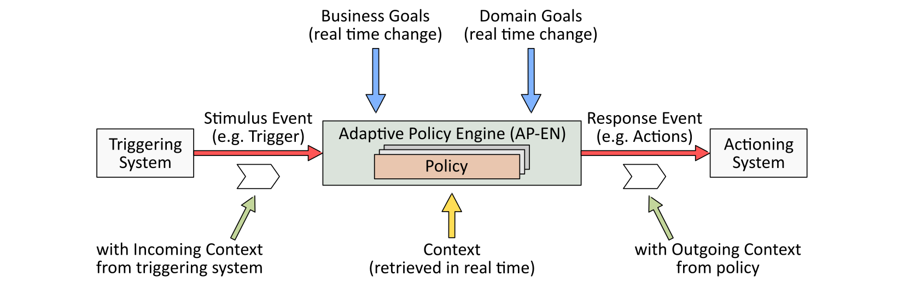
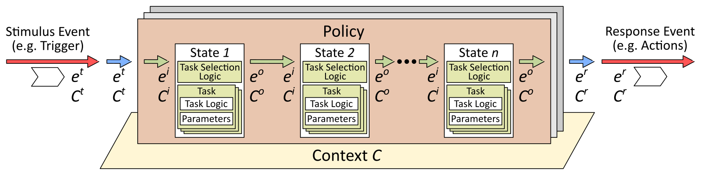
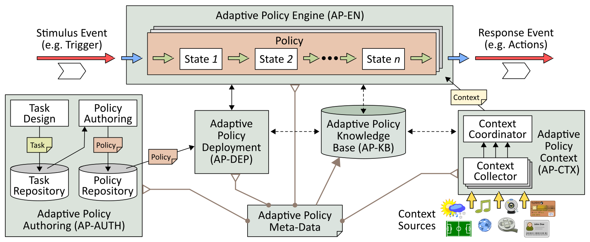
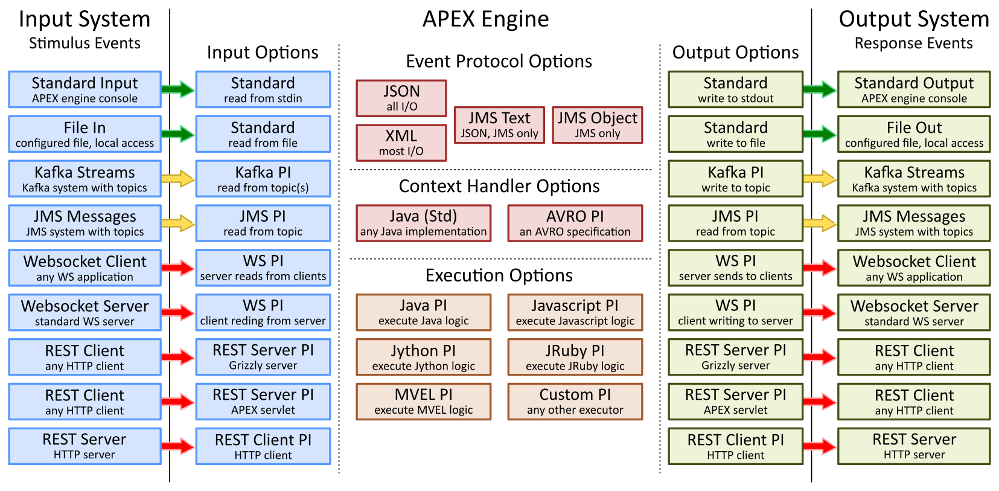
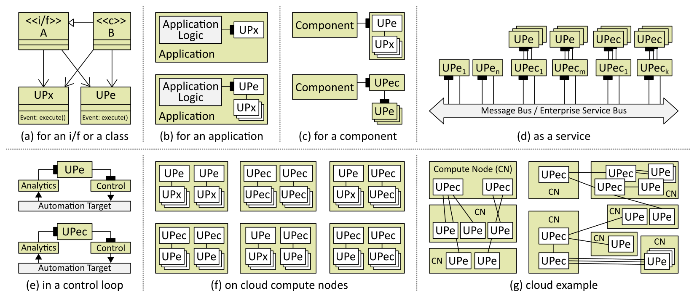
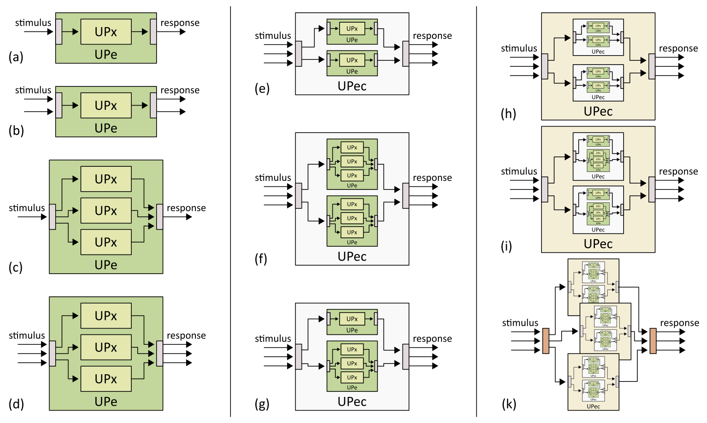

.. This work is licensed under a Creative Commons Attribution 4.0 International License.
.. http://creativecommons.org/licenses/by/4.0

A short Introduction to APEX
*****************************

.. contents::
    :depth: 3

Introduction to APEX
^^^^^^^^^^^^^^^^^^^^

      .. container:: sectionbody

         .. container:: paragraph

            APEX stand for Adaptive Policy EXecution. It is a
            lightweight engine for execution of policies. APEX allows
            you to specify logic as a policy, logic that you can adapt
            on the fly as your system executes. The APEX policies you
            design can be really simple, with a single snippet of logic,
            or can be very complex, with many states and tasks. APEX
            policies can even be designed to self-adapt at execution
            time, the choice is yours!

         .. container:: imageblock

            .. container:: content

               |Simple APEX Overview|

            .. container:: title

               Figure 1. Simple APEX Overview

         .. container:: paragraph

            The Adaptive Policy Engine in APEX runs your policies. These
            policies are triggered by incoming events. The logic of the
            policies executes and produces a response event. The
            *Incoming Context* on the incoming event and the *Outgoing
            Context* on the outgoing event are simply the fields and
            attributes of the event. You design the policies that APEX
            executes and the trigger and action events that your
            policies accept and produce. Events are fed in and sent out
            as JSON or XML events over Kafka, a Websocket, a file or
            named pipe, or even standard input. If you run APEX as a
            library in your application, you can even feed and receive
            events over a Java API.

         .. container:: imageblock

            .. container:: content

               |APEX States and Context|

            .. container:: title

               Figure 2. APEX States and Context

         .. container:: paragraph

            You design your policy as a chain of states, with each state
            being fed by the state before. The simplest policy can have
            just one state. We provide specific support for the
            four-state `MEDA (Match Establish Decide
            Act) <https://www.researchgate.net/publication/303564082_Apex_An_Engine_for_Dynamic_Adaptive_Policy_Execution>`__
            policy state model and the three-state `ECA (Event Condition
            Action) <https://en.wikipedia.org/wiki/Event_condition_action>`__
            policy state model. APEX is fully distributed. You can
            decide how many APEX engine instances to run for your
            application and on which real or virtual hosts to run them.

         .. container:: paragraph

            In APEX, you also have control of the *Context* used by your
            policies. Context is simply the state information and data
            used by your policies. You define what context your policies
            use and what the scope of that context is. *Policy Context*
            is private to a particular policy and is accessible only to
            whatever APEX engines are running that particular policy.
            *Global Context* is available to all policies. *External
            Context* is read-only context such as weather or topology
            information that is provided by other systems. APEX keeps
            context coordinated across all the the instances running a
            particular policy. If a policy running in an APEX engine
            changes the value of a piece of context, that value is is
            available to all other APEX engines that use that piece of
            context. APEX takes care of distribution, locking, writing
            of context to persistent storage, and monitoring of context.

         .. container:: imageblock

            .. container:: content

               |The APEX Eco-System|

            .. container:: title

               Figure 3. The APEX Eco-System

         .. container:: paragraph

            The APEX engine (AP-EN) is available as a Java library for
            inclusion in your application, as a microservice running in
            a Docker container, or as a stand-alone service available
            for integration into your system. APEX also includes a
            policy editor (AP-AUTH) that allows you to design your
            policies and a web-based policy management console you use
            to deploy policies and to keep track of the state of
            policies and context in policies. Context handling (AP-CTX)
            is integrated into the APEX engine and policy deployment
            (AP-DEP) is provided as a servlet running under a web
            framework such as `Apache
            Tomcat <http://tomcat.apache.org/>`__.

APEX Configuration
^^^^^^^^^^^^^^^^^^

      .. container:: sectionbody

         .. container:: paragraph

            An APEX engine can be configured to use various combinations
            of event input handlers, event output handlers, event
            protocols, context handlers, and logic executors. The system
            is build using a plugin architecture. Each configuration
            option is realized by a plugin, which can be loaded and
            configured when the engine is started. New plugins can be
            added to the system at any time, though to benefit from a
            new plugin an engine will need to be restarted.

         .. container:: imageblock

            .. container:: content

               |APEX Configuration Matrix|

            .. container:: title

               Figure 4. APEX Configuration Matrix

         .. container:: paragraph

            The APEX distribution already comes with a number of
            plugins. The figure above shows the provided plugins. Any
            combination of input, output, event protocol, context
            handlers, and executors is possible.

APEX Policy Matrix
^^^^^^^^^^^^^^^^^^

      .. container:: sectionbody

         .. container:: paragraph

            APEX offers a lot of flexibility for defining, deploying,
            and executing policies. Based on a theoretic model, it
            supports virtually any policy model and allows to translate
            legacy policies into the APEX execution format. However, the
            most important aspect for using APEX is to decide what
            policy is needed, what underlying policy concepts should be
            used, and how the decision logic should be realized. Once
            these aspects are decided, APEX can be used to execute the
            policies. If the policy evolves, say from a simple decision
            table to a fully adaptable policy, only the policy
            definition requires change. APEX supports all of that.

         .. container:: paragraph

            The figure below shows a (non-exhaustive) matrix, which will
            help to decide what policy is required to solve your
            problem. Read the matrix from left to right choosing one
            cell in each column.

         .. container:: imageblock

            .. container:: content

               |APEX Policy Matrix|

            .. container:: title

               Figure 5. APEX Policy Matrix

         .. container:: paragraph

            The policy can support one of a number of stimuli with an
            associated purpose/model of the policy, for instance:

         .. container:: ulist

            -  Configuration, i.e. what should happen. An example is an
               event that states an intended network configuration and
               the policy should provide the detailed actions for it.
               The policy can be realized for instance as an obligation
               policy, a promise or an intent.

            -  Report, i.e. something did happen. An example is an event
               about an error or fault and the policy needs to repair
               that problem. The policy would usually be an obligation,
               utility function, or goal policy.

            -  Monitoring, i.e. something does happen. An example is a
               notification about certain network conditions, to which
               the policy might (or might not) react. The policy will
               mitigate the monitored events or permit (deny) related
               actions as an obligation or authorization.

            -  Analysis, i.e. why did something happen. An example is an
               analytic component sends insights of a situation
               requiring a policy to act on it. The policy can solve the
               problem, escalate it, or delegate it as a refrain or
               delegation policy.

            -  Prediction, i.e. what will happen next. An example are
               events that a policy uses to predict a future network
               condition. The policy can prevent or enforce the
               prediction as an adaptive policy, a utility function, or
               a goal.

            -  Feedback, i.e. why did something happen or not happen.
               Similar to analysis, but here the feedback will be in the
               input event and the policy needs to something with that
               information. Feedback can be related to history or
               experience, for instance a previous policy execution. The
               policy needs to be context-aware or be a meta-policy.

         .. container:: paragraph

            Once the purpose of the policy is decided, the next step is
            to look into what context information the policy will
            require to do its job. This can range from very simple to a
            lot of different information, for instance:

         .. container:: ulist

            -  No context, nothing but a trigger event, e.g. a string or
               a number, is required

            -  Event context, the incoming event provides all
               information (more than a string or number) for the policy

            -  Policy context (read only), the policy has access to
               additional information related to its class but cannot
               change/alter them

            -  Policy context (read and write), the policy has access to
               additional information related to its class and can alter
               this information (for instance to record historic
               information)

            -  Global context (read only), the policy has access to
               additional information of any kind but cannot
               change/alter them

            -  Global context (read and write), the policy the policy
               has access to additional information of any kind and can
               alter this information (for instance to record historic
               information)

         .. container:: paragraph

            The next step is to decide how the policy should do its job,
            i.e. what flavor it has, how many states are needed, and how
            many tasks. There are many possible combinations, for
            instance:

         .. container:: ulist

            -  Simple / God: a simple policy with 1 state and 1 task,
               which is doing everything for the decision-making. This
               is the ideal policy for simple situation, e.g. deciding
               on configuration parameters or simple access control.

            -  Simple sequence: a simple policy with a number of states
               each having a single task. This is a very good policy for
               simple decision-making with different steps. For
               instance, a classic action policy (ECA) would have 3
               states (E, C, and A) with some logic (1 task) in each
               state.

            -  Simple selective: a policy with 1 state but more than one
               task. Here, the appropriate task (and it’s logic) will be
               selected at execution time. This policy is very good for
               dealing with similar (or the same) situation in different
               contexts. For instance, the tasks can be related to
               available external software, or to current work load on
               the compute node, or to time of day.

            -  Selective: any number of states having any number of
               tasks (usually more than 1 task). This is a combination
               of the two policies above, for instance an ECA policy
               with more than one task in E, C, and A.

            -  Classic directed: a policy with more than one state, each
               having one task, but a non-sequential execution. This
               means that the sequence of the states is not pre-defined
               in the policy (as would be for all cases above) but
               calculated at runtime. This can be good to realize
               decision trees based on contextual information.

            -  Super Adaptive: using the full potential of the APEX
               policy model, states and tasks and state execution are
               fully flexible and calculated at runtime (per policy
               execution). This policy is very close to a general
               programming system (with only a few limitations), but can
               solve very hard problems.

         .. container:: paragraph

            The final step is to select a response that the policy
            creates. Possible responses have been discussed in the
            literature for a very long time. A few examples are:

         .. container:: ulist

            -  Obligation (deontic for what should happen)

            -  Authorization (e.g. for rule-based or other access
               control or security systems)

            -  Intent (instead of providing detailed actions the
               response is an intent statement and a further system
               processes that)

            -  Delegation (hand the problem over to someone else,
               possibly with some information or instructions)

            -  Fail / Error (the policy has encountered a problem, and
               reports it)

            -  Feedback (why did the policy make a certain decision)

Flexible Deployment
^^^^^^^^^^^^^^^^^^^

      .. container:: sectionbody

         .. container:: paragraph

            APEX can be deployed in various ways. The following figure
            shows a few of these deployment options. Engine and (policy)
            executors are named UPe (universal policy engine, APEX
            engine) and UPx (universal policy executor, the APEX
            internal state machine executor).

         .. container:: imageblock

            .. container:: content

               |APEX Deployment Options|

            .. container:: title

               Figure 6. APEX Deployment Options

         .. container:: olist loweralpha

            a. For an interface or class

               .. container:: ulist

                  -  Either UPx or UPe as association

            b. For an application

               .. container:: ulist

                  -  UPx as object for single policies

                  -  UPe as object for multiple policies

            c. For a component (as service)

               .. container:: ulist

                  -  UPe as service for requests

                  -  UPec as service for requests

            d. As a service (PolaS)

               .. container:: ulist

                  -  One or more UPe with service i/f

                  -  One or more Upec/UPec with service i/f

                  -  One or more Upec/UPec with service i/f

            e. In a control loop

               .. container:: ulist

                  -  UPe as decision making part

                  -  UPec as decision making part

            f. On cloud compute nodes

               .. container:: ulist

                  -  Nodes with only UPe or Upec

                  -  Nodes with any combination of UPe, UPec

            g. A cloud example

               .. container:: ulist

                  -  Left: 2 UPec managing several UPe on different
                     cloud nodes

                  -  Right: 2 large UPec with different UPe/UPec
                     deployments

Flexible Clustering
^^^^^^^^^^^^^^^^^^^

      .. container:: sectionbody

         .. container:: paragraph

            APEX can be clustered in various ways. The following figure
            shows a few of these clustering options. Cluster, engine and
            (policy) executors are named UPec (universal policy
            cluster), UPe (universal policy engine, APEX engine) and UPx
            (universal policy executor, the APEX internal state machine
            executor).

         .. container:: imageblock

            .. container:: content

               |APEX Clustering Options|

            .. container:: title

               Figure 7. APEX Clustering Options

         .. container:: olist loweralpha

            a. Single source/target, single UPx

               .. container:: ulist

                  -  Simple forward

            b. Multiple sources/targets, single UPx

               .. container:: ulist

                  -  Simple forward

            c. Single source/target, multiple UPx

               .. container:: ulist

                  -  Multithreading (MT) in UPe

            d. Multiple sources/targets, multiple UPx instances

               .. container:: ulist

                  -  Simple forward & MT in UPe

            e. Multiple non-MT UPe in UPec

               .. container:: ulist

                  -  Simple event routing

            f. Multiple MT UPe in UPec

               .. container:: ulist

                  -  Simple event routing

            g. Mixed UPe in UPec

               .. container:: ulist

                  -  Simple event routing

            h. Multiple non-MT UPec in UPec

               .. container:: ulist

                  -  Intelligent event routing

            i. Multiple mixed UPec in UPec

               .. container:: ulist

                  -  Intelligent event routing

         .. container:: olist loweralpha

            k. Mix of UPec in multiple UPec

               .. container:: ulist

                  -  External intelligent event routing

                  -  Optimized with UPec internal routing

Resources
^^^^^^^^^

      .. container:: sectionbody

         .. container:: ulist

            -  APEX Documentation hosted on Github:
               https://ericsson.github.io/apex-docs

            -  APEX source code repository hosted by ONAP:
               https://gerrit.onap.org/r/#/admin/projects/policy/apex-pdp

            -  Issue Management (source and documentation, ONAP JIRA,
               requires a Linux Foundation ID):
               https://jira.onap.org/projects/POLICY/issues

            -  List of APEX publications:
               https://ericsson.github.io/apex-docs/apex-publications.html

.. container::
   :name: footer

   .. container::
      :name: footer-text

      2.0.0-SNAPSHOT
      Last updated 2018-09-04 16:04:24 IST

.. |APEX Policy Matrix| image:: images/apex-intro/ApexPolicyMatrix.png

