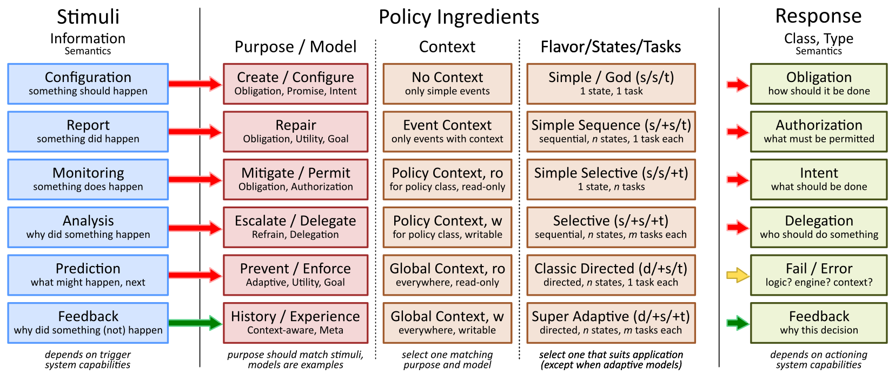
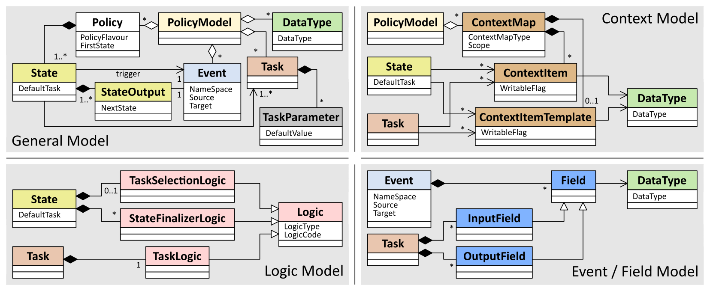
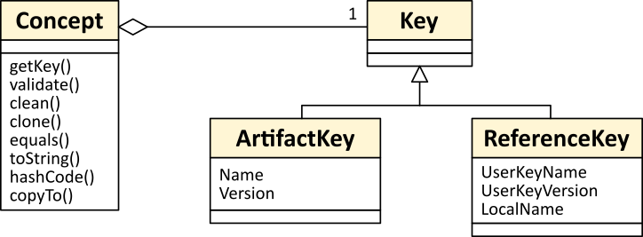

.. This work is licensed under a Creative Commons Attribution 4.0 International License.
.. http://creativecommons.org/licenses/by/4.0


APEX Policy Guide
*****************************

.. contents::
    :depth: 3

APEX Policy Matrix
^^^^^^^^^^^^^^^^^^

APEX Policy Matrix
------------------

            .. container:: paragraph

               APEX offers a lot of flexibility for defining, deploying,
               and executing policies. Based on a theoretic model, it
               supports virtually any policy model and allows to
               translate legacy policies into the APEX execution format.
               However, the most important aspect for using APEX is to
               decide what policy is needed, what underlying policy
               concepts should be used, and how the decision logic
               should be realized. Once these aspects are decided, APEX
               can be used to execute the policies. If the policy
               evolves, say from a simple decision table to a fully
               adaptable policy, only the policy definition requires
               change. APEX supports all of that.

            .. container:: paragraph

               The figure below shows a (non-exhaustive) matrix, which
               will help to decide what policy is required to solve your
               problem. Read the matrix from left to right choosing one
               cell in each column.

            .. container:: imageblock

               .. container:: content

                  |APEX Policy Matrix|

               .. container:: title

                  Figure 1. APEX Policy Matrix

            .. container:: paragraph

               The policy can support one of a number of stimuli with an
               associated purpose/model of the policy, for instance:

            .. container:: ulist

               -  Configuration, i.e. what should happen. An example is
                  an event that states an intended network configuration
                  and the policy should provide the detailed actions for
                  it. The policy can be realized for instance as an
                  obligation policy, a promise or an intent.

               -  Report, i.e. something did happen. An example is an
                  event about an error or fault and the policy needs to
                  repair that problem. The policy would usually be an
                  obligation, utility function, or goal policy.

               -  Monitoring, i.e. something does happen. An example is
                  a notification about certain network conditions, to
                  which the policy might (or might not) react. The
                  policy will mitigate the monitored events or permit
                  (deny) related actions as an obligation or
                  authorization.

               -  Analysis, i.e. why did something happen. An example is
                  an analytic component sends insights of a situation
                  requiring a policy to act on it. The policy can solve
                  the problem, escalate it, or delegate it as a refrain
                  or delegation policy.

               -  Prediction, i.e. what will happen next. An example are
                  events that a policy uses to predict a future network
                  condition. The policy can prevent or enforce the
                  prediction as an adaptive policy, a utility function,
                  or a goal.

               -  Feedback, i.e. why did something happen or not happen.
                  Similar to analysis, but here the feedback will be in
                  the input event and the policy needs to something with
                  that information. Feedback can be related to history
                  or experience, for instance a previous policy
                  execution. The policy needs to be context-aware or be
                  a meta-policy.

            .. container:: paragraph

               Once the purpose of the policy is decided, the next step
               is to look into what context information the policy will
               require to do its job. This can range from very simple to
               a lot of different information, for instance:

            .. container:: ulist

               -  No context, nothing but a trigger event, e.g. a string
                  or a number, is required

               -  Event context, the incoming event provides all
                  information (more than a string or number) for the
                  policy

               -  Policy context (read only), the policy has access to
                  additional information related to its class but cannot
                  change/alter them

               -  Policy context (read and write), the policy has access
                  to additional information related to its class and can
                  alter this information (for instance to record
                  historic information)

               -  Global context (read only), the policy has access to
                  additional information of any kind but cannot
                  change/alter them

               -  Global context (read and write), the policy the policy
                  has access to additional information of any kind and
                  can alter this information (for instance to record
                  historic information)

            .. container:: paragraph

               The next step is to decide how the policy should do its
               job, i.e. what flavor it has, how many states are needed,
               and how many tasks. There are many possible combinations,
               for instance:

            .. container:: ulist

               -  Simple / God: a simple policy with 1 state and 1 task,
                  which is doing everything for the decision-making.
                  This is the ideal policy for simple situation, e.g.
                  deciding on configuration parameters or simple access
                  control.

               -  Simple sequence: a simple policy with a number of
                  states each having a single task. This is a very good
                  policy for simple decision-making with different
                  steps. For instance, a classic action policy (ECA)
                  would have 3 states (E, C, and A) with some logic (1
                  task) in each state.

               -  Simple selective: a policy with 1 state but more than
                  one task. Here, the appropriate task (and it’s logic)
                  will be selected at execution time. This policy is
                  very good for dealing with similar (or the same)
                  situation in different contexts. For instance, the
                  tasks can be related to available external software,
                  or to current work load on the compute node, or to
                  time of day.

               -  Selective: any number of states having any number of
                  tasks (usually more than 1 task). This is a
                  combination of the two policies above, for instance an
                  ECA policy with more than one task in E, C, and A.

               -  Classic directed: a policy with more than one state,
                  each having one task, but a non-sequential execution.
                  This means that the sequence of the states is not
                  pre-defined in the policy (as would be for all cases
                  above) but calculated at runtime. This can be good to
                  realize decision trees based on contextual
                  information.

               -  Super Adaptive: using the full potential of the APEX
                  policy model, states and tasks and state execution are
                  fully flexible and calculated at runtime (per policy
                  execution). This policy is very close to a general
                  programming system (with only a few limitations), but
                  can solve very hard problems.

            .. container:: paragraph

               The final step is to select a response that the policy
               creates. Possible responses have been discussed in the
               literature for a very long time. A few examples are:

            .. container:: ulist

               -  Obligation (deontic for what should happen)

               -  Authorization (e.g. for rule-based or other access
                  control or security systems)

               -  Intent (instead of providing detailed actions the
                  response is an intent statement and a further system
                  processes that)

               -  Delegation (hand the problem over to someone else,
                  possibly with some information or instructions)

               -  Fail / Error (the policy has encountered a problem,
                  and reports it)

               -  Feedback (why did the policy make a certain decision)

APEX Policy Model
^^^^^^^^^^^^^^^^^

Introduction
------------

            .. container:: paragraph

               The APEX policy model is shown in UML notation in the
               figure below. A policy model can be stored in JSON or XML
               format in a file or can be held in a database. The APEX
               editor creates and modifies APEX policy models. APEX
               deployment deploys policy models, and a policy model is
               loaded into APEX engines so that the engines can run the
               policies in the policy model.

            .. container:: paragraph

               The figure shows four different views of the policy
               model:

            .. container:: ulist

               -  The general model view shows the main parts of a
                  policy: state, state output, event, and task. A task
                  can also have parameters. Data types can be defined on
                  a per-model basis using either standard atomic types
                  (such as character, string, numbers) or complex types
                  from a policy domain.

               -  The logic model view emphasizes how decision-making
                  logic is injected into a policy. There are essentially
                  three different types of logic: task logic (for
                  decision making in a task), task selection logic (to
                  select a task if more than one is defined in a state),
                  and state finalizer logic (to compute the final output
                  event of a state and select an appropriate next state
                  from the policy model).

               -  The context model view shows how context is injected
                  into a policy. States collect all context from their
                  tasks. A task can define what context it requires for
                  the decision making, i.e. what context the task logic
                  will process. Context itself is a collection of items
                  (individual context information) with data types.
                  Context can be templated.

               -  The event and field model view shows the events in the
                  policy model. Tasks define what information they
                  consume (input) and produce (output). This information
                  is modeled as fields, essentially a key/type tuple in
                  the model and a key/type/value triple at execution.
                  Events then are collection of fields.

            .. container:: imageblock

               .. container:: content

                  |APEX Policy Model for Execution|

               .. container:: title

                  Figure 2. APEX Policy Model for Execution

Concepts and Keys
#################

               .. container:: paragraph

                  Each element of the policy model is called a
                  *concept*. Each *concept* is a subclass of the
                  abstract *Concept* class, as shown in the next figure.
                  Every concept implements the following abstract
                  methods:

               .. container:: imageblock

                  .. container:: content

                     |Concepts and Keys|

                  .. container:: title

                     Figure 3. Concepts and Keys

               .. container:: ulist

                  -  ``getKey()`` - gets the unique key for this concept
                     instance in the system

                  -  ``validate()`` - validates the structure of this
                     concept, its sub-concepts and its relationships

                  -  ``clean()`` - carries out housekeeping on the
                     concept such as trimming strings, remove any
                     hanging references

                  -  ``clone()`` - creates a deep copy of an instance of
                     this concept

                  -  ``equals()`` - checks if two instances of this
                     concept are equal

                  -  ``toString()`` - returns a string representation of
                     the concept

                  -  ``hashCode()`` - returns a hash code for the
                     concept

                  -  ``copyTo()`` - carries out a deep copy of one
                     instance of the concept to another instance,
                     overwriting the target fields.

               .. container:: paragraph

                  All concepts must have a *key*, which uniquely
                  identifies a concept instance. The *key* of a subclass
                  of an *Concept* must either be an ``ArtifactKey`` or
                  an ``ReferenceKey``. Concepts that have a stand-alone
                  independent existence such as *Policy*, *Task*, and
                  *Event* must have an ``ArtifctKey`` key. Concepts that
                  are contained in other concepts, that do not exist as
                  stand-alone concepts must have an ``ReferenceKey``
                  key. Examples of such concepts are *State* and
                  *EventParameter*.

               .. container:: paragraph

                  An ``ArticactKey`` has two fields; the *Name* of the
                  concept it is the key for and the concept’s *Version*.
                  A concept’s name must be unique in a given
                  PolicyModel. A concept version is represented using
                  the well known *major.minor.path* scheme as used in
                  semantic versioning.

               .. container:: paragraph

                  A ``ReferenceKey`` has three fields. The *UserKeyName*
                  and *UserKeyVersion* fields identify the
                  ``ArtifactKey`` of the concept in which the concept
                  keyed by the ``ReferenceKey`` is contained. The
                  *LocalName* field identifies the contained concept
                  instance. The *LocalName* must be unique in the
                  concepts of a given type contained by a parent.

               .. container:: paragraph

                  For example, a policy called ``SalesPolicy`` with a
                  Version of ``1.12.4`` has a state called ``Decide``.
                  The ``Decide`` state is linked to the ``SalesPolicy``
                  with a ``ReferenceKey`` with fields *UserKeyName* of
                  ``SalesPolicy``, *UserKeyVersion* of ``1.12.4``, and
                  *LocalName* of ``Decide``. There must not be another
                  state called ``Decide`` in the policy ``SalesPolicy``.
                  However, there may well be a state called ``Decide``
                  in some other policy called ``PurchasingPolicy``.

               .. container:: paragraph

                  Each concept in the model is also a JPA (`Java
                  Persistence
                  API <https://en.wikipedia.org/wiki/Java_Persistence_API>`__)
                  Entity. This means that every concept can be
                  individually persisted or the entire model can be
                  persisted en-bloc to any persistence mechanism using
                  an JPA framework such as
                  `Hibernate <http://hibernate.org/>`__ or
                  `EclipseLink <http://www.eclipse.org/eclipselink/>`__.

Concept: PolicyModel
####################

               .. container:: paragraph

                  The *PolicyModel* concept is a container that holds
                  the definition of a set of policies and their
                  associated events, context maps, and tasks. A
                  *PolicyModel* is implemented as four maps for
                  policies, events, context maps, and tasks. Each map is
                  indexed by the key of the policy, event, context map,
                  or task. Any non-empty policy model must have at least
                  one entry in its policy, event, and task map because
                  all policies must have at least one input and output
                  event and must execute at least one task.

               .. container:: paragraph

                  A *PolicyModel* concept is keyed with an
                  ``ArtifactKey key``. Because a *PolicyModel* is an
                  ``AxConcept``, calling the ``validate()`` method on a
                  policy model validates the concepts, structure, and
                  relationships of the entire policy model.

Concept: DataType
#################

               .. container:: paragraph

                  Data types are tightly controlled in APEX in order to
                  provide a very high degree of consistency in policies
                  and to facilitate tracking of changes to context as
                  policies execute. All context is modeled as a
                  *DataType* concept. Each DataType concept instance is
                  keyed with an ``ArtifactKey`` key. The DataType field
                  identifies the Java class of objects that is used to
                  represent concept instances that use this data type.
                  All context has a *DataType*; incoming and outgoing
                  context is represented by *EventField* concepts and
                  all other context is represented by *ContextItem*
                  concepts.

Concept: Event
##############

               .. container:: paragraph

                  An *Event* defines the structure of a message that
                  passes into or out of an APEX engine or that passes
                  between two states in an APEX engine. APEX supports
                  message reception and sending in many formats and all
                  messages are translated into an *Event* prior to
                  processing by an APEX engine. Event concepts are keyed
                  with an ``ArtifactKey`` key. The parameters of an
                  event are held as a map of *EventField* concept
                  instances with each parameter indexed by the
                  *LocalName* of its ``ReferenceKey``. An *Event* has
                  three fields:

               .. container:: ulist

                  -  The *NameSpace* identifies the domain of
                     application of the event

                  -  The *Source* of the event identifies the system
                     that emitted the event

                  -  The *Target* of the event identifies the system
                     that the event was sent to

               .. container:: paragraph

                  A *PolicyModel* contains a map of all the events known
                  to a given policy model. Although an empty model may
                  have no events in its event map, any sane policy model
                  must have at least one *Event* defined.

Concept: EventField
###################

               .. container:: paragraph

                  The incoming context and outgoing context of an event
                  are the fields of the event. Each field representing a
                  single piece of incoming or outgoing context. Each
                  field of an *Event* is represented by an instance of
                  the *EventField* concept. Each *EventField* concept
                  instance in an event is keyed with a ``ReferenceKey``
                  key, which references the event. The *LocalName* field
                  of the ``ReferenceKey`` holds the name of the field A
                  reference to a *DataType* concept defines the data
                  type that values of this parameter have at run time.

Concept: ContextMap
###################

               .. container:: paragraph

                  The set of context that is available for use by the
                  policies of a *PolicyModel* is defined as *ContextMap*
                  concept instances. The *PolicyModel* holds a map of
                  all the *ContextMap* definitions. A *ContextMap* is
                  itself a container for a group of related context
                  items, each of which is represented by a *ContextItem*
                  concept instance. *ContextMap* concepts are keyed with
                  an ``ArtifactKey`` key. A developer can use the APEX
                  Policy Editor to create context maps for their
                  application domain.

               .. container:: paragraph

                  A *ContextMap* uses a map to hold the context items.
                  The ContextItem concept instances in the map are
                  indexed by the *LocalName* of their ``ReferenceKey``.

               .. container:: paragraph

                  The *ContextMapType* field of a *ContextMap* defines
                  the type of a context map. The type can have either of
                  two values:

               .. container:: ulist

                  -  A *BAG* context map is a context map with fixed
                     content. Each possible context item in the context
                     map is defined at design time and is held in the
                     *ContextMap* context instance as *ContextItem*
                     concept definitions and only the values of the
                     context items in the context map can be changed at
                     run time. The context items in a *BAG* context map
                     have mixed types and distinct *ContextItem* concept
                     instances of the same type can be defined. A *BAG*
                     context map is convenient for defining a group of
                     context items that are diverse but are related by
                     domain, such as the characteristics of a device. A
                     fully defined *BAG* context map has a fully
                     populated *ContextItem* map but its
                     *ContextItemTemplate* reference is not defined.

                  -  A *SAMETYPE* context map is used to represent a
                     group of *ContextItem* instances of the same type.
                     Unlike a *BAG* context map, the *ContextItem*
                     concept instances of a *SAMETYPE* context map can
                     be added, modified, and deleted at runtime. All
                     *ContextItem* concept instances in a *SAMETYPE*
                     context map must be of the same type, and that
                     context item is defined as a single
                     *ContextItemTemplate* concept instances at design
                     time. At run time, the *ContextItemTemplate*
                     definition is used to create new *ContextItem*
                     concept instances for the context map on demand. A
                     fully defined *SAMETYPE context map has an empty
                     ContextItem map and its ContextItemTemplate\_*
                     reference is defined.

               .. container:: paragraph

                  The *Scope* of a *ContextMap* defines the range of
                  applicability of a context map in APEX. The following
                  scopes of applicability are defined:

               .. container:: ulist

                  -  *EPHEMERAL* scope means that the context map is
                     owned, used, and modified by a single application,
                     but the context map only exists while that
                     application is running

                  -  *APPLICATION* scope specifies that the context map
                     is owned, used, and modified by a single
                     application, the context map is persistent

                  -  *GLOBAL* scope specifies that the context map is
                     globally owned and is used and modified by any
                     application, the context map is persistent

                  -  *EXTERNAL* scope specifies that the context map is
                     owned by an external system and may be used in a
                     read-only manner by any application, the context
                     map is persistent

               .. container:: paragraph

                  A much more sophisticated scoping mechanism for
                  context maps is envisaged for Apex in future work. In
                  such a mechanism, the scope of a context map would
                  work somewhat like the way roles work in security
                  authentication systems.

Concept: ContextItem
####################

               .. container:: paragraph

                  Each piece of context in a *ContextMap* is represented
                  by an instance of the *ContextItem* concept. Each
                  *ContextItem* concept instance in a context map keyed
                  with a ``ReferenceKey`` key, which references the
                  context map of the context item. The *LocalName* field
                  of the ``ReferenceKey`` holds the name of the context
                  item in the context map A reference to a *DataType*
                  concept defines the data type that values of this
                  context item have at run time. The *WritableFlag*
                  indicates if the context item is read only or
                  read-write at run time.

Concept: ContextItemTemplate
############################

               .. container:: paragraph

                  In a *SAMETYPE* *ContextMap*, the
                  *ContextItemTemplate* definition provides a template
                  for the *ContextItem* instances that will be created
                  on the context map at run time. Each *ContextItem*
                  concept instance in the context map is created using
                  the *ContextItemTemplate* template. It is keyed with a
                  ``ReferenceKey`` key, which references the context map
                  of the context item. The *LocalName* field of the
                  ``ReferenceKey``, supplied by the creator of the
                  context item at run time, holds the name of the
                  context item in the context map. A reference to a
                  *DataType* concept defines the data type that values
                  of this context item have at run time. The
                  *WritableFlag* indicates if the context item is read
                  only or read-write at run time.

Concept: Task
#############

               .. container:: paragraph

                  The smallest unit of logic in a policy is a *Task*. A
                  task encapsulates a single atomic unit of logic, and
                  is designed to be a single indivisible unit of
                  execution. A task may be invoked by a single policy or
                  by many policies. A task has a single trigger event,
                  which is sent to the task when it is invoked. Tasks
                  emit one or more outgoing events, which carry the
                  result of the task execution. Tasks may use or modify
                  context as they execute.

               .. container:: paragraph

                  The Task concept definition captures the definition of
                  an APEX task. Task concepts are keyed with an
                  ``ArtifactKey`` key. The Trigger of the task is a
                  reference to the *Event* concept that triggers the
                  task. The *OutgoingEvents* of a task are a set of
                  references to *Event* concepts that may be emitted by
                  the task.

               .. container:: paragraph

                  All tasks have logic, some code that is programmed to
                  execute the work of the task. The *Logic* concept of
                  the task holds the definition of that logic.

               .. container:: paragraph

                  The *Task* definition holds a set of *ContextItem* and
                  *ContextItemTemplate* context items that the task is
                  allow to access, as defined by the task developer at
                  design time. The type of access (read-only or read
                  write) that a task has is determined by the
                  *WritableFlag* flag on the individual context item
                  definitions. At run time, a task may only access the
                  context items specified in its context item set, the
                  APEX engine makes only the context items in the task
                  context item set is available to the task.

               .. container:: paragraph

                  A task can be configured with startup parameters. The
                  set of parameters that can be configured on a task are
                  defined as a set of *TaskParameter* concept
                  definitions.

Concept: TaskParameter
######################

               .. container:: paragraph

                  Each configuration parameter of a task are represented
                  as a *Taskparameter* concept keyed with a
                  ``ReferenceKey`` key, which references the task. The
                  *LocalName* field of the ``ReferenceKey`` holds the
                  name of the parameter. The *DefaultValue* field
                  defines the default value that the task parameter is
                  set to. The value of *TaskParameter* instances can be
                  overridden at deployment time by specifying their
                  values in the configuration information passed to APEX
                  engines.

Concept: Logic
##############

               .. container:: paragraph

                  The *Logic* concept instance holds the actual
                  programmed task logic for a task defined in a *Task*
                  concept or the programmed task selection logic for a
                  state defined in a *State* concept. It is keyed with a
                  ``ReferenceKey`` key, which references the task or
                  state that owns the logic. The *LocalName* field of
                  the Logic concept is the name of the logic.

               .. container:: paragraph

                  The *LogicCode* field of a Logic concept definition is
                  a string that holds the program code that is to be
                  executed at run time. The *LogicType* field defines
                  the language of the code. The standard values are the
                  logic languages supported by APEX:
                  `JAVASCRIPT <https://en.wikipedia.org/wiki/JavaScript>`__,
                  `JAVA <https://java.com/en/>`__,
                  `JYTHON <http://www.jython.org/>`__,
                  `JRUBY <http://jruby.org/>`__, or
                  `MVEL <https://en.wikibooks.org/wiki/Transwiki:MVEL_Language_Guide>`__.

               .. container:: paragraph

                  The APEX engine uses the *LogicType* field value to
                  decide which language interpreter to use for a task
                  and then sends the logic defined in the *LogicCode*
                  field to that interpreter.

Concept: Policy
###############

               .. container:: paragraph

                  The *Policy* concept defines a policy in APEX. The
                  definition is rather straightforward. A policy is made
                  up of a set of states with the flavor of the policy
                  determining the structure of the policy states and the
                  first state defining what state in the policy executes
                  first. *Policy* concepts are keyed with an
                  ``ArtifactKey`` key.

               .. container:: paragraph

                  The *PolicyFlavour* of a *Policy* concept specifies
                  the structure that will be used for the states in the
                  policy. A number of commonly used policy patterns are
                  supported as APEX policy flavors. The standard policy
                  flavors are:

               .. container:: ulist

                  -  The *MEDA* flavor supports policies written to the
                     `MEDA policy
                     pattern <https://www.researchgate.net/publication/282576518_Dynamically_Adaptive_Policies_for_Dynamically_Adaptive_Telecommunications_Networks>`__
                     and require a sequence of four states: namely
                     *Match*, *Establish*, *Decide* and *Act*.

                  -  The *OODA* flavor supports policies written to the
                     `OODA loop
                     pattern <https://en.wikipedia.org/wiki/OODA_loop>`__
                     and require a sequence of four states: namely
                     *Observe*, *Orient*, *Decide* and *Act*.

                  -  The *ECA* flavor supports policies written to the
                     `ECA active rule
                     pattern <https://en.wikipedia.org/wiki/Event_condition_action>`__
                     and require a sequence of three states: namely
                     *Event*, *Condition* and *Action*

                  -  The *XACML* flavor supports policies written in
                     `XACML <https://en.wikipedia.org/wiki/XACML>`__ and
                     require a single state: namely *XACML*

                  -  The *FREEFORM* flavor supports policies written in
                     an arbitrary style. A user can define a *FREEFORM*
                     policy as an arbitrarily long chain of states.

               .. container:: paragraph

                  The *FirstState* field of a *Policy* definition is the
                  starting point for execution of a policy. Therefore,
                  the trigger event of the state referenced in the
                  *FirstState* field is also the trigger event for the
                  entire policy.

Concept: State
##############

               .. container:: paragraph

                  The *State* concept represents a phase or a stage in a
                  policy, with a policy being composed of a series of
                  states. Each state has at least one but may have many
                  tasks and, on each run of execution, a state executes
                  one and only one of its tasks. If a state has more
                  than one task, then its task selection logic is used
                  to select which task to execute. Task selection logic
                  is programmable logic provided by the state designer.
                  That logic can use incoming, policy, global, and
                  external context to select which task best
                  accomplishes the purpose of the state in a give
                  situation if more than one task has been specified on
                  a state. A state calls one and only one task when it
                  is executed.

               .. container:: paragraph

                  Each state is triggered by an event, which means that
                  all tasks of a state must also be triggered by that
                  same event. The set of output events for a state is
                  the union of all output events from all tasks for that
                  task. In practice at the moment, because a state can
                  only have a single input event, a state that is not
                  the final state of a policy may only output a single
                  event and all tasks of that state may also only output
                  that single event. In future work, the concept of
                  having a less restrictive trigger pattern will be
                  examined.

               .. container:: paragraph

                  A *State* concept is keyed with a ``ReferenceKey``
                  key, which references the *Policy* concept that owns
                  the state. The *LocalName* field of the
                  ``ReferenceKey`` holds the name of the state. As a
                  state is part of a chain of states, the *NextState*
                  field of a state holds the ``ReferenceKey`` key of the
                  state in the policy to execute after this state.

               .. container:: paragraph

                  The *Trigger* field of a state holds the
                  ``ArtifactKey`` of the event that triggers this state.
                  The *OutgoingEvents* field holds the ``ArtifactKey``
                  references of all possible events that may be output
                  from the state. This is a set that is the union of all
                  output events of all tasks of the state.

               .. container:: paragraph

                  The *Task* concepts that hold the definitions of the
                  task for the state are held as a set of
                  ``ArtifactKey`` references in the state. The
                  *DefaultTask* field holds a reference to the default
                  task for the state, a task that is executed if no task
                  selection logic is specified. If the state has only
                  one task, that task is the default task.

               .. container:: paragraph

                  The *Logic* concept referenced by a state holds the
                  task selection logic for a state. The task selection
                  logic uses the incoming context (parameters of the
                  incoming event) and other context to determine the
                  best task to use to execute its goals. The state holds
                  a set of references to *ContextItem* and
                  *ContextItemTemplate* definitions for the context used
                  by its task selection logic.

Writing Logic
^^^^^^^^^^^^^

Writing APEX Task Logic
-----------------------

            .. container:: paragraph

               Task logic specifies the behavior of an Apex Task. This
               logic can be specified in a number of ways, exploiting
               Apex’s plug-in architecture to support a range of logic
               executors. In Apex scripted Task Logic can be written in
               any of these languages:

            .. container:: ulist

               -  ```MVEL`` <https://en.wikipedia.org/wiki/MVEL>`__,

               -  ```JavaScript`` <https://en.wikipedia.org/wiki/JavaScript>`__,

               -  ```JRuby`` <https://en.wikipedia.org/wiki/JRuby>`__ or

               -  ```Jython`` <https://en.wikipedia.org/wiki/Jython>`__.

            .. container:: paragraph

               These languages were chosen because the scripts can be
               compiled into Java bytecode at runtime and then
               efficiently executed natively in the JVM. Task Logic an
               also be written directly in Java but needs to be
               compiled, with the resulting classes added to the
               classpath. There are also a number of other Task Logic
               types (e.g. Fuzzy Logic), but these are not supported as
               yet. This guide will focus on the scripted Task Logic
               approaches, with MVEL and JavaScript being our favorite
               languages. In particular this guide will focus on the
               Apex aspects of the scripts. However, this guide does not
               attempt to teach you about the scripting languages
               themselves …​ that is up to you!

            .. tip::  
			   JVM-based scripting languages
			   For more more information on scripting for the Java platform see: https://docs.oracle.com/javase/8/docs/technotes/guides/scripting/prog_guide/index.html

            .. note:: 
			   What do Tasks do?
			   The function of an Apex Task is to provide the logic that can be executed for an Apex State as one of the steps in
			   an Apex Policy. Each task receives some *incoming fields*, executes some logic (e.g: make a decision based on
			   *shared state* or *context*, *incoming fields*, *external context*, etc.), perhaps set some *shared state* or 
			   *context* and then emits *outgoing fields*. The state that uses the task is responsible for extracting the
			   *incoming fields* from the state input event. The state also has an *output mapper* associated with the task, and
			   this *output mapper* is responsible for mapping the *outgoing fields* from the task into an appropriate
			   output event for the state.

            .. container:: paragraph

               First lets start with a sample task, drawn from the "My
               First Apex Policy" example: The task "MorningBoozeCheck"
               from the "My First Apex Policy" example is available in
               both MVEL and JavaScript:

            .. container:: listingblock

               .. container:: title

                  Javascript code for the ``MorningBoozeCheck`` task

               .. container:: content

                  .. code:: javascript
                     :number-lines:

                     /*
                      * ============LICENSE_START=======================================================
                      *  Copyright (C) 2016-2018 Ericsson. All rights reserved.
                      * ================================================================================
                      * Licensed under the Apache License, Version 2.0 (the "License");
                      * you may not use this file except in compliance with the License.
                      * You may obtain a copy of the License at
                      *
                      *      http://www.apache.org/licenses/LICENSE-2.0
                      *
                      * Unless required by applicable law or agreed to in writing, software
                      * distributed under the License is distributed on an "AS IS" BASIS,
                      * WITHOUT WARRANTIES OR CONDITIONS OF ANY KIND, either express or implied.
                      * See the License for the specific language governing permissions and
                      * limitations under the License.
                      *
                      * SPDX-License-Identifier: Apache-2.0
                      * ============LICENSE_END=========================================================
                      */

                     var returnValueType = Java.type("java.lang.Boolean");
                     var returnValue = new returnValueType(true);

                     // Load compatibility script for imports etc
                     load("nashorn:mozilla_compat.js");
                     importPackage(java.text);
                     importClass(java.text.SimpleDateFormat);

                     executor.logger.info("Task Execution: '"+executor.subject.id+"'. Input Fields: '"+executor.inFields+"'");

                     executor.outFields.put("amount"      , executor.inFields.get("amount"));
                     executor.outFields.put("assistant_ID", executor.inFields.get("assistant_ID"));
                     executor.outFields.put("notes"       , executor.inFields.get("notes"));
                     executor.outFields.put("quantity"    , executor.inFields.get("quantity"));
                     executor.outFields.put("branch_ID"   , executor.inFields.get("branch_ID"));
                     executor.outFields.put("item_ID"     , executor.inFields.get("item_ID"));
                     executor.outFields.put("time"        , executor.inFields.get("time"));
                     executor.outFields.put("sale_ID"     , executor.inFields.get("sale_ID"));

                     item_id = executor.inFields.get("item_ID");

                     //All times in this script are in GMT/UTC since the policy and events assume time is in GMT.
                     var timenow_gmt =  new Date(Number(executor.inFields.get("time")));

                     var midnight_gmt = new Date(Number(executor.inFields.get("time")));
                     midnight_gmt.setUTCHours(0,0,0,0);

                     var eleven30_gmt = new Date(Number(executor.inFields.get("time")));
                     eleven30_gmt.setUTCHours(11,30,0,0);

                     var timeformatter = new java.text.SimpleDateFormat("HH:mm:ss z");

                     var itemisalcohol = false;
                     if(item_id != null && item_id >=1000 && item_id < 2000)
                         itemisalcohol = true;

                     if( itemisalcohol
                         && timenow_gmt.getTime() >= midnight_gmt.getTime()
                         && timenow_gmt.getTime() <  eleven30_gmt.getTime()) {

                       executor.outFields.put("authorised", false);
                       executor.outFields.put("message", "Sale not authorised by policy task " +
                         executor.subject.taskName+ " for time " + timeformatter.format(timenow_gmt.getTime()) +
                         ". Alcohol can not be sold between " + timeformatter.format(midnight_gmt.getTime()) +
                         " and " + timeformatter.format(eleven30_gmt.getTime()));
                     }
                     else{
                       executor.outFields.put("authorised", true);
                       executor.outFields.put("message", "Sale authorised by policy task " +
                         executor.subject.taskName + " for time "+timeformatter.format(timenow_gmt.getTime()));
                     }

                     /*
                     This task checks if a sale request is for an item that is an alcoholic drink.
                     If the local time is between 00:00:00 GMT and 11:30:00 GMT then the sale is not
                     authorised. Otherwise the sale is authorised.
                     In this implementation we assume that items with item_ID value between 1000 and
                     2000 are all alcoholic drinks :-)
                     */

            .. container:: listingblock

               .. container:: title

                  MVEL code for the ``MorningBoozeCheck`` task

               .. container:: content

                  .. code:: javascript 
                     :number-lines:

                     /*
                      * ============LICENSE_START=======================================================
                      *  Copyright (C) 2016-2018 Ericsson. All rights reserved.
                      * ================================================================================
                      * Licensed under the Apache License, Version 2.0 (the "License");
                      * you may not use this file except in compliance with the License.
                      * You may obtain a copy of the License at
                      *
                      *      http://www.apache.org/licenses/LICENSE-2.0
                      *
                      * Unless required by applicable law or agreed to in writing, software
                      * distributed under the License is distributed on an "AS IS" BASIS,
                      * WITHOUT WARRANTIES OR CONDITIONS OF ANY KIND, either express or implied.
                      * See the License for the specific language governing permissions and
                      * limitations under the License.
                      *
                      * SPDX-License-Identifier: Apache-2.0
                      * ============LICENSE_END=========================================================
                      */
                     import java.util.Date;
                     import java.util.Calendar;
                     import java.util.TimeZone;
                     import java.text.SimpleDateFormat;

                     logger.info("Task Execution: '"+subject.id+"'. Input Fields: '"+inFields+"'");

                     outFields.put("amount"      , inFields.get("amount"));
                     outFields.put("assistant_ID", inFields.get("assistant_ID"));
                     outFields.put("notes"       , inFields.get("notes"));
                     outFields.put("quantity"    , inFields.get("quantity"));
                     outFields.put("branch_ID"   , inFields.get("branch_ID"));
                     outFields.put("item_ID"     , inFields.get("item_ID"));
                     outFields.put("time"        , inFields.get("time"));
                     outFields.put("sale_ID"     , inFields.get("sale_ID"));

                     item_id = inFields.get("item_ID");

                     //The events used later to test this task use GMT timezone!
                     gmt = TimeZone.getTimeZone("GMT");
                     timenow = Calendar.getInstance(gmt);
                     df = new SimpleDateFormat("HH:mm:ss z");
                     df.setTimeZone(gmt);
                     timenow.setTimeInMillis(inFields.get("time"));

                     midnight = timenow.clone();
                     midnight.set(
                         timenow.get(Calendar.YEAR),timenow.get(Calendar.MONTH),
                         timenow.get(Calendar.DATE),0,0,0);
                     eleven30 = timenow.clone();
                     eleven30.set(
                         timenow.get(Calendar.YEAR),timenow.get(Calendar.MONTH),
                         timenow.get(Calendar.DATE),11,30,0);

                     itemisalcohol = false;
                     if(item_id != null && item_id >=1000 && item_id < 2000)
                         itemisalcohol = true;

                     if( itemisalcohol
                         && timenow.after(midnight) && timenow.before(eleven30)){
                       outFields.put("authorised", false);
                       outFields.put("message", "Sale not authorised by policy task "+subject.taskName+
                         " for time "+df.format(timenow.getTime())+
                         ". Alcohol can not be sold between "+df.format(midnight.getTime())+
                         " and "+df.format(eleven30.getTime()));
                       return true;
                     }
                     else{
                       outFields.put("authorised", true);
                       outFields.put("message", "Sale authorised by policy task "+subject.taskName+
                         " for time "+df.format(timenow.getTime()));
                       return true;
                     }

                     /*
                     This task checks if a sale request is for an item that is an alcoholic drink.
                     If the local time is between 00:00:00 GMT and 11:30:00 GMT then the sale is not
                     authorised. Otherwise the sale is authorised.
                     In this implementation we assume that items with item_ID value between 1000 and
                     2000 are all alcoholic drinks :-)
                     */

            .. container:: paragraph

               The role of the task in this simple example is to copy
               the values in the incoming fields into the outgoing
               fields, then examine the values in some incoming fields
               (``item_id`` and ``time``), then set the values in some
               other outgoing fields (``authorised`` and ``message``).

            .. container:: paragraph

               Both MVEL and JavaScript like most JVM-based scripting
               languages can use standard Java libraries to perform
               complex tasks. Towards the top of the scripts you will
               see how to import Java classes and packages to be used
               directly in the logic. Another thing to notice is that
               Task Logic should return a ``java.lang.Boolean`` value
               ``true`` if the logic executed correctly. If the logic
               fails for some reason then ``false`` can be returned, but
               this will cause the policy invoking this task will fail
               and exit.

            .. note::
			   How to return a value from task logic 
			   Some languages explicitly support returning values from the script (e.g. MVEL and JRuby) using an explicit 
			   return statement (e.g. ``return true``), other languages do not (e.g. JavaScript and Jython). For
			   languages that do not support the ``return`` statement, a special field called ``returnValue`` must be
			   created to hold the result of the task logic operation (i.e. assign a ``java.lang.Boolean``
			   value to the ``returnValue`` field before completing the task).
			   Also, in MVEL if there is no explicit return statement then the return value of the last executed statement will return
			   (e.g. the statement a=(1+2) will return the value 3).

            .. container:: paragraph

               Besides these imported classes and normal language
               features Apex provides some natively available parameters
               and functions that can be used directly. At run-time
               these parameters are populated by the Apex execution
               environment and made natively available to logic scripts
               each time the logic script is invoked. (These can be
               accessed using the ``executor`` keyword for most
               languages, or can be accessed directly without the
               ``executor`` keyword in MVEL):

            Table 1. The ``executor`` Fields / Methods
	  
+------------+-------------+--------------------------------+-------------------------------------------------------------------------------------+
| Name       | Type        | Java type                      | Description                                                                         |
+============+=============+================================+=====================================================================================+
| inFields   | Fields      | java.util.Map <String,Object>  | .. container:: paragraph                                                            |
|            |             |                                |                                                                                     |
|            |             |                                |    The incoming task fields. This is implemented as a standard Java                 |
|            |             |                                |    Java (unmodifiable) Map                                                          |
|            |             |                                |                                                                                     |
|            |             |                                | .. container::                                                                      |
|            |             |                                |                                                                                     |
|            |             |                                |    .. container:: content                                                           |
|            |             |                                |                                                                                     |
|            |             |                                |       .. container:: paragraph                                                      |
|            |             |                                |                                                                                     |
|            |             |                                |          **Example:**                                                               |
|            |             |                                |                                                                                     |
|            |             |                                |       .. code:: javascript                                                          |
|            |             |                                |                                                                                     |
|            |             |                                |          executor.logger.debug("Incoming fields: "                                  |
|            |             |                                |             +executor.inFields.entrySet());                                         |
|            |             |                                |          var item_id = executor.incomingFields["item_ID"];                          |
|            |             |                                |          if (item_id >=1000) { ... }                                                |
+------------+-------------+--------------------------------+-------------------------------------------------------------------------------------+
| outFields  | Fields      | java.util.Map <String,Object>  | .. container:: paragraph                                                            |
|            |             |                                |                                                                                     |
|            |             |                                |    The outgoing task fields. This is implemented as a standard initially empty Java |
|            |             |                                |    (modifiable) Map. To create a new schema-compliant instance of a field object    |
|            |             |                                |    see the utility method subject.getOutFieldSchemaHelper() below                   |
|            |             |                                |                                                                                     |
|            |             |                                | .. container::                                                                      |
|            |             |                                |                                                                                     |
|            |             |                                |    .. container:: content                                                           |
|            |             |                                |                                                                                     |
|            |             |                                |       .. container:: paragraph                                                      |
|            |             |                                |                                                                                     |
|            |             |                                |          **Example:**                                                               |
|            |             |                                |                                                                                     |
|            |             |                                |       .. code:: javascript                                                          |
|            |             |                                |                                                                                     |
|            |             |                                |          executor.outFields["authorised"] = false;                                  |
+------------+-------------+--------------------------------+-------------------------------------------------------------------------------------+
| logger     | Logger      | org.slf4j.ext.XLogger          | .. container:: paragraph                                                            |
|            |             |                                |                                                                                     |
|            |             |                                |    A helpful logger                                                                 |
|            |             |                                |                                                                                     |
|            |             |                                | .. container::                                                                      |
|            |             |                                |                                                                                     |
|            |             |                                |    .. container:: content                                                           |
|            |             |                                |                                                                                     |
|            |             |                                |       .. container:: paragraph                                                      |
|            |             |                                |                                                                                     |
|            |             |                                |          **Example:**                                                               |
|            |             |                                |                                                                                     |
|            |             |                                |       .. code:: javascript                                                          |
|            |             |                                |                                                                                     |
|            |             |                                |          executor.logger.info("Executing task: "                                    |
|            |             |                                |             +executor.subject.id);                                                  |
+------------+-------------+--------------------------------+-------------------------------------------------------------------------------------+
| TRUE/FALSE | boolean     | java.lang.Boolean              | .. container:: paragraph                                                            |
|            |             |                                |                                                                                     |
|            |             |                                |    2 helpful constants. These are useful to retrieve correct return  values for the |
|            |             |                                |    task logic                                                                       |
|            |             |                                |                                                                                     |
|            |             |                                | .. container::                                                                      |
|            |             |                                |                                                                                     |
|            |             |                                |    .. container:: content                                                           |
|            |             |                                |                                                                                     |
|            |             |                                |       .. container:: paragraph                                                      |
|            |             |                                |                                                                                     |
|            |             |                                |          **Example:**                                                               |
|            |             |                                |                                                                                     |
|            |             |                                |       .. code:: javascript                                                          |
|            |             |                                |                                                                                     |
|            |             |                                |          var returnValue = executor.isTrue;                                         |
|            |             |                                |          var returnValueType = Java.type("java.lang.Boolean");                      |
|            |             |                                |          var returnValue = new returnValueType(true);                               |
+------------+-------------+--------------------------------+-------------------------------------------------------------------------------------+
| subject    | Task        | TaskFacade                     | .. container:: paragraph                                                            |
|            |             |                                |                                                                                     |
|            |             |                                |    This provides some useful information about the task that contains this task     |
|            |             |                                |    logic. This object has some useful fields and methods :                          |
|            |             |                                |                                                                                     |
|            |             |                                | .. container:: ulist                                                                |
|            |             |                                |                                                                                     |
|            |             |                                |    -  **AxTask task** to get access to the full task definition of                  |
|            |             |                                |       the host task                                                                 |
|            |             |                                |                                                                                     |
|            |             |                                |    -  **String getTaskName()** to get the name of the host task                     |
|            |             |                                |                                                                                     |
|            |             |                                |    -  **String getId()** to get the ID of the host task                             |
|            |             |                                |                                                                                     |
|            |             |                                |    -  **SchemaHelper getInFieldSchemaHelper( String fieldName )** to                |
|            |             |                                |       get a ``SchemaHelper`` helper object to manipulate incoming                   |
|            |             |                                |       task fields in a schema-aware manner                                          |
|            |             |                                |                                                                                     |
|            |             |                                |    -  **SchemaHelper getOutFieldSchemaHelper( String fieldName )** to               |
|            |             |                                |       get a ``SchemaHelper`` helper object to manipulate outgoing                   |
|            |             |                                |       task fields in a schema-aware manner, e.g. to instantiate new                 |
|            |             |                                |       schema-compliant field objects to populate the                                |
|            |             |                                |       ``executor.outFields`` outgoing fields map                                    |
|            |             |                                |                                                                                     |
|            |             |                                | .. container::                                                                      |
|            |             |                                |                                                                                     |
|            |             |                                |    .. container:: content                                                           |
|            |             |                                |                                                                                     |
|            |             |                                |       .. container:: paragraph                                                      |
|            |             |                                |                                                                                     |
|            |             |                                |          **Example:**                                                               |
|            |             |                                |                                                                                     |
|            |             |                                |       .. code:: javascript                                                          |
|            |             |                                |                                                                                     |
|            |             |                                |          executor.logger.info("Task name: "                                         |
|            |             |                                |             +executor.subject.getTaskName());                                       |
|            |             |                                |          executor.logger.info("Task id: "                                           |
|            |             |                                |             +executor.subject.getId());                                             |
|            |             |                                |          executor.logger.info("Task inputs definitions: "                           |
|            |             |                                |             +"executor.subject.task.getInputFieldSet());                            |
|            |             |                                |          executor.logger.info("Task outputs definitions: "                          |
|            |             |                                |             +"executor.subject.task.getOutputFieldSet());                           |
|            |             |                                |          executor.outFields["authorised"] = executor.subject                        |
|            |             |                                |                .getOutFieldSchemaHelper("authorised")                               |
|            |             |                                |               .createNewInstance("false");                                          |
+------------+-------------+--------------------------------+-------------------------------------------------------------------------------------+
| ContextAlbum getContextAlbum(String ctxtAlbumName )       | .. container:: paragraph                                                            |
|                                                           |                                                                                     |
|                                                           |    A utility method to retrieve a ``ContextAlbum`` for use in the task.             |
|                                                           |    This is how you access the context used by the task. The returned                |
|                                                           |    ``ContextAlbum`` implements the ``java.util.Map <String,Object>``                |
|                                                           |    interface to get and set context as appropriate. The returned                    |
|                                                           |    ``ContextAlbum`` also has methods to lock context albums, get                    |
|                                                           |    information about the schema of the items to be stored in a context              |
|                                                           |    album, and get a ``SchemaHelper`` to manipulate context album items. How         |
|                                                           |    to define and use context in a task is described in the Apex                     |
|                                                           |    Programmer’s Guide and in the My First Apex Policy guide.                        |
|                                                           |                                                                                     |
|                                                           | .. container::                                                                      |
|                                                           |                                                                                     |
|                                                           |    .. container:: content                                                           |
|                                                           |                                                                                     |
|                                                           |       .. container:: paragraph                                                      |
|                                                           |                                                                                     |
|                                                           |          **Example:**                                                               |
|                                                           |                                                                                     |
|                                                           |       .. code:: javascript                                                          |
|                                                           |                                                                                     |
|                                                           |          var bkey = executor.inFields.get("branch_ID");                             |
|                                                           |          var cnts = executor.getContextMap("BranchCounts");                         |
|                                                           |          cnts.lockForWriting(bkey);                                                 |
|                                                           |          cnts.put(bkey, cnts.get(bkey) + 1);                                        |
|                                                           |          cnts.unlockForWriting(bkey);                                               |
+------------+-------------+--------------------------------+-------------------------------------------------------------------------------------+

Writing APEX Task Selection Logic
---------------------------------

   .. container:: paragraph

      The function of Task Selection Logic is to choose which task
      should be executed for an Apex State as one of the steps in an
      Apex Policy. Since each state must define a default task there is
      no need for Task Selection Logic unless the state uses more than
      one task. This logic can be specified in a number of ways,
      exploiting Apex’s plug-in architecture to support a range of logic
      executors. In Apex scripted Task Selection Logic can be written in
      any of these languages:

   .. container:: ulist

      -  ```MVEL`` <https://en.wikipedia.org/wiki/MVEL>`__,

      -  ```JavaScript`` <https://en.wikipedia.org/wiki/JavaScript>`__,

      -  ```JRuby`` <https://en.wikipedia.org/wiki/JRuby>`__ or

      -  ```Jython`` <https://en.wikipedia.org/wiki/Jython>`__.

   .. container:: paragraph

      These languages were chosen because the scripts can be compiled
      into Java bytecode at runtime and then efficiently executed
      natively in the JVM. Task Selection Logic an also be written
      directly in Java but needs to be compiled, with the resulting
      classes added to the classpath. There are also a number of other
      Task Selection Logic types but these are not supported as yet.
      This guide will focus on the scripted Task Selection Logic
      approaches, with MVEL and JavaScript being our favorite languages.
      In particular this guide will focus on the Apex aspects of the
      scripts. However, this guide does not attempt to teach you about
      the scripting languages themselves …​ that is up to you!

   .. tip::
      JVM-based scripting languages 
	  For more more information on Scripting for the Java platform see:
	  https://docs.oracle.com/javase/8/docs/technotes/guides/scripting/prog_guide/index.html

   .. note::  
      What does Task Selection Logic do? 
	  When an Apex state references multiple tasks, there must be a way to dynamically decide
	  which task should be chosen and executed. This can depend on the many factors, e.g. the
	  *incoming event for the state*, *shared state* or *context*, *external context*,
	  etc.. This is the function of a state’s Task Selection Logic. Obviously, if there is 
	  only one task then Task only one task then Task Selection Logic is not needed. 
	  Each state must also select one of the tasks a the *default state*. If the Task 
	  Selection Logic is unable to select an appropriate task, then it should select the 
	  *default task*. Once the task has been selected the Apex Engine will then execute that
	  task.

   .. container:: paragraph

      First lets start with some simple Task Selection Logic, drawn from
      the "My First Apex Policy" example: The Task Selection Logic from
      the "My First Apex Policy" example is specified in JavaScript
      here:

   .. container:: listingblock

      .. container:: title

         Javascript code for the "My First Policy" Task Selection Logic

      .. container:: content

         .. code:: javascript

            /*
             * ============LICENSE_START=======================================================
             *  Copyright (C) 2016-2018 Ericsson. All rights reserved.
             * ================================================================================
             * Licensed under the Apache License, Version 2.0 (the "License");
             * you may not use this file except in compliance with the License.
             * You may obtain a copy of the License at
             *
             *      http://www.apache.org/licenses/LICENSE-2.0
             *
             * Unless required by applicable law or agreed to in writing, software
             * distributed under the License is distributed on an "AS IS" BASIS,
             * WITHOUT WARRANTIES OR CONDITIONS OF ANY KIND, either express or implied.
             * See the License for the specific language governing permissions and
             * limitations under the License.
             *
             * SPDX-License-Identifier: Apache-2.0
             * ============LICENSE_END=========================================================
             */


            var returnValueType = Java.type("java.lang.Boolean");
            var returnValue = new returnValueType(true);

            executor.logger.info("Task Selection Execution: '"+executor.subject.id+
                "'. Input Event: '"+executor.inFields+"'");

            branchid = executor.inFields.get("branch_ID");
            taskorig = executor.subject.getTaskKey("MorningBoozeCheck");
            taskalt = executor.subject.getTaskKey("MorningBoozeCheckAlt1");
            taskdef = executor.subject.getDefaultTaskKey();

            if(branchid >=0 && branchid <1000){
              taskorig.copyTo(executor.selectedTask);
            }
            else if (branchid >=1000 && branchid <2000){
              taskalt.copyTo(executor.selectedTask);
            }
            else{
              taskdef.copyTo(executor.selectedTask);
            }

            /*
            This task selection logic selects task "MorningBoozeCheck" for branches with
            0<=branch_ID<1000 and selects task "MorningBoozeCheckAlt1" for branches with
            1000<=branch_ID<2000. Otherwise the default task is selected.
            In this case the default task is also "MorningBoozeCheck"
            */

   .. container:: paragraph

      The role of the Task Selection Logic in this simple example is to
      examine the value in one incoming field (``branchid``), then
      depending on that field’s value set the value for the selected
      task to the appropriate task (``MorningBoozeCheck``,
      ``MorningBoozeCheckAlt1``, or the default task).

   .. container:: paragraph

      Another thing to notice is that Task Selection Logic should return
      a ``java.lang.Boolean`` value ``true`` if the logic executed
      correctly. If the logic fails for some reason then ``false`` can
      be returned, but this will cause the policy invoking this task
      will fail and exit.

   .. note:: 
      How to return a value from Task Selection Logic
	  Some languages explicitly support returning values from the script (e.g. MVEL and 
	  JRuby) using an explicit return statement (e.g. ``return true``), other languages do not (e.g.
	  JavaScript and Jython). For languages that do not support the ``return`` statement, a special field called 
	  ``returnValue`` must be created to hold the result of the task logic operation (i.e. assign a ``java.lang.Boolean``
	  value to the ``returnValue`` field before completing the task). 
	  Also, in MVEL if there is not explicit return statement then the return value of the last executed statement will
	  return (e.g. the statement a=(1+2) will return the value 3).   

   .. container:: paragraph

      Each of the scripting languages used in Apex can import and use
      standard Java libraries to perform complex tasks. Besides imported
      classes and normal language features Apex provides some natively
      available parameters and functions that can be used directly. At
      run-time these parameters are populated by the Apex execution
      environment and made natively available to logic scripts each time
      the logic script is invoked. (These can be accessed using the
      ``executor`` keyword for most languages, or can be accessed
      directly without the ``executor`` keyword in MVEL):

   Table 2. The ``executor`` Fields / Methods
      +-------------------------------------------------------+--------------------------------------------------------+
      | Unix, Cygwin                                          | Windows                                                |
      +=======================================================+========================================================+
      | .. container::                                        | .. container::                                         |
      |                                                       |                                                        |
      |    .. container:: content                             |    .. container:: content                              |
      |                                                       |                                                        |
      |       .. code:: bash                                  |       .. code:: bash                                   |
      |         :number-lines:                                |         :number-lines:                                 |
      |                                                       |                                                        |
      |         >c:                                           |         # cd /usr/local/src/apex-pdp                   |
      |         >cd \dev\apex                                 |         # mvn clean install -DskipTest                 |
      |         >mvn clean install -DskipTests                |                                                        |
      +-------------------------------------------------------+--------------------------------------------------------+

+------------+-------------+--------------------------------+-------------------------------------------------------------------------------------+
| Name       | Type        | Java type                      | Description                                                                         |
+============+=============+================================+=====================================================================================+
| inFields   | Fields      | java.util.Map <String,Object>  | .. container:: paragraph                                                            |
|            |             |                                |                                                                                     |
|            |             |                                |    All fields in the state’s incoming event. This is implemented as a standard Java |
|            |             |                                |    Java (unmodifiable) Map                                                          |
|            |             |                                |                                                                                     |
|            |             |                                | .. container::                                                                      |
|            |             |                                |                                                                                     |
|            |             |                                |    .. container:: content                                                           |
|            |             |                                |                                                                                     |
|            |             |                                |       .. container:: paragraph                                                      |
|            |             |                                |                                                                                     |
|            |             |                                |          **Example:**                                                               |
|            |             |                                |                                                                                     |
|            |             |                                |       .. code:: javascript                                                          |
|            |             |                                |                                                                                     |
|            |             |                                |          executor.logger.debug("Incoming fields: "                                  |
|            |             |                                |             +executor.inFields.entrySet());                                         |
|            |             |                                |          var item_id = executor.incomingFields["item_ID"];                          |
|            |             |                                |          if (item_id >=1000) { ... }                                                |
+------------+-------------+--------------------------------+-------------------------------------------------------------------------------------+
| outFields  | Fields      | java.util.Map <String,Object>  | .. container:: paragraph                                                            |
|            |             |                                |                                                                                     |
|            |             |                                |    The outgoing task fields. This is implemented as a standard initially empty Java |
|            |             |                                |    (modifiable) Map. To create a new schema-compliant instance of a field object    |
|            |             |                                |    see the utility method subject.getOutFieldSchemaHelper() below                   |
|            |             |                                |                                                                                     |
|            |             |                                | .. container::                                                                      |
|            |             |                                |                                                                                     |
|            |             |                                |    .. container:: content                                                           |
|            |             |                                |                                                                                     |
|            |             |                                |       .. container:: paragraph                                                      |
|            |             |                                |                                                                                     |
|            |             |                                |          **Example:**                                                               |
|            |             |                                |                                                                                     |
|            |             |                                |       .. code:: javascript                                                          |
|            |             |                                |                                                                                     |
|            |             |                                |          executor.outFields["authorised"] = false;                                  |
+------------+-------------+--------------------------------+-------------------------------------------------------------------------------------+
| logger     | Logger      | org.slf4j.ext.XLogger          | .. container:: paragraph                                                            |
|            |             |                                |                                                                                     |
|            |             |                                |    A helpful logger                                                                 |
|            |             |                                |                                                                                     |
|            |             |                                | .. container::                                                                      |
|            |             |                                |                                                                                     |
|            |             |                                |    .. container:: content                                                           |
|            |             |                                |                                                                                     |
|            |             |                                |       .. container:: paragraph                                                      |
|            |             |                                |                                                                                     |
|            |             |                                |          **Example:**                                                               |
|            |             |                                |                                                                                     |
|            |             |                                |       .. code:: javascript                                                          |
|            |             |                                |                                                                                     |
|            |             |                                |          executor.logger.info("Executing task: "                                    |
|            |             |                                |             +executor.subject.id);                                                  |
+------------+-------------+--------------------------------+-------------------------------------------------------------------------------------+
| TRUE/FALSE | boolean     | java.lang.Boolean              | .. container:: paragraph                                                            |
|            |             |                                |                                                                                     |
|            |             |                                |    2 helpful constants. These are useful to retrieve correct return  values for the |
|            |             |                                |    task logic                                                                       |
|            |             |                                |                                                                                     |
|            |             |                                | .. container::                                                                      |
|            |             |                                |                                                                                     |
|            |             |                                |    .. container:: content                                                           |
|            |             |                                |                                                                                     |
|            |             |                                |       .. container:: paragraph                                                      |
|            |             |                                |                                                                                     |
|            |             |                                |          **Example:**                                                               |
|            |             |                                |                                                                                     |
|            |             |                                |       .. code:: javascript                                                          |
|            |             |                                |                                                                                     |
|            |             |                                |          var returnValue = executor.isTrue;                                         |
|            |             |                                |          var returnValueType = Java.type("java.lang.Boolean");                      |
|            |             |                                |          var returnValue = new returnValueType(true);                               |
+------------+-------------+--------------------------------+-------------------------------------------------------------------------------------+
| subject    | Task        | TaskFacade                     | .. container:: paragraph                                                            |
|            |             |                                |                                                                                     |
|            |             |                                |    This provides some useful information about the task that contains this task     |
|            |             |                                |    logic. This object has some useful fields and methods :                          |
|            |             |                                |                                                                                     |
|            |             |                                | .. container:: ulist                                                                |
|            |             |                                |                                                                                     |
|            |             |                                |    -  **AxTask task** to get access to the full task definition of                  |
|            |             |                                |       the host task                                                                 |
|            |             |                                |                                                                                     |
|            |             |                                |    -  **String getTaskName()** to get the name of the host task                     |
|            |             |                                |                                                                                     |
|            |             |                                |    -  **String getId()** to get the ID of the host task                             |
|            |             |                                |                                                                                     |
|            |             |                                |    -  **SchemaHelper getInFieldSchemaHelper( String fieldName )** to                |
|            |             |                                |       get a ``SchemaHelper`` helper object to manipulate incoming                   |
|            |             |                                |       task fields in a schema-aware manner                                          |
|            |             |                                |                                                                                     |
|            |             |                                |    -  **SchemaHelper getOutFieldSchemaHelper( String fieldName )** to               |
|            |             |                                |       get a ``SchemaHelper`` helper object to manipulate outgoing                   |
|            |             |                                |       task fields in a schema-aware manner, e.g. to instantiate new                 |
|            |             |                                |       schema-compliant field objects to populate the                                |
|            |             |                                |       ``executor.outFields`` outgoing fields map                                    |
|            |             |                                |                                                                                     |
|            |             |                                | .. container::                                                                      |
|            |             |                                |                                                                                     |
|            |             |                                |    .. container:: content                                                           |
|            |             |                                |                                                                                     |
|            |             |                                |       .. container:: paragraph                                                      |
|            |             |                                |                                                                                     |
|            |             |                                |          **Example:**                                                               |
|            |             |                                |                                                                                     |
|            |             |                                |       .. code:: javascript                                                          |
|            |             |                                |                                                                                     |
|            |             |                                |          executor.logger.info("Task name: "                                         |
|            |             |                                |             +executor.subject.getTaskName());                                       |
|            |             |                                |          executor.logger.info("Task id: "                                           |
|            |             |                                |             +executor.subject.getId());                                             |
|            |             |                                |          executor.logger.info("Task inputs definitions: "                           |
|            |             |                                |             +"executor.subject.task.getInputFieldSet());                            |
|            |             |                                |          executor.logger.info("Task outputs definitions: "                          |
|            |             |                                |             +"executor.subject.task.getOutputFieldSet());                           |
|            |             |                                |          executor.outFields["authorised"] = executor.subject                        |
|            |             |                                |                .getOutFieldSchemaHelper("authorised")                               |
|            |             |                                |               .createNewInstance("false");                                          |
+------------+-------------+--------------------------------+-------------------------------------------------------------------------------------+
| ContextAlbum getContextAlbum(String ctxtAlbumName )       | .. container:: paragraph                                                            |
|                                                           |                                                                                     |
|                                                           |    A utility method to retrieve a ``ContextAlbum`` for use in the task.             |
|                                                           |    This is how you access the context used by the task. The returned                |
|                                                           |    ``ContextAlbum`` implements the ``java.util.Map <String,Object>``                |
|                                                           |    interface to get and set context as appropriate. The returned                    |
|                                                           |    ``ContextAlbum`` also has methods to lock context albums, get                    |
|                                                           |    information about the schema of the items to be stored in a context              |
|                                                           |    album, and get a ``SchemaHelper`` to manipulate context album items. How         |
|                                                           |    to define and use context in a task is described in the Apex                     |
|                                                           |    Programmer’s Guide and in the My First Apex Policy guide.                        |
|                                                           |                                                                                     |
|                                                           | .. container::                                                                      |
|                                                           |                                                                                     |
|                                                           |    .. container:: content                                                           |
|                                                           |                                                                                     |
|                                                           |       .. container:: paragraph                                                      |
|                                                           |                                                                                     |
|                                                           |          **Example:**                                                               |
|                                                           |                                                                                     |
|                                                           |       .. code:: javascript                                                          |
|                                                           |                                                                                     |
|                                                           |          var bkey = executor.inFields.get("branch_ID");                             |
|                                                           |          var cnts = executor.getContextMap("BranchCounts");                         |
|                                                           |          cnts.lockForWriting(bkey);                                                 |
|                                                           |          cnts.put(bkey, cnts.get(bkey) + 1);                                        |
|                                                           |          cnts.unlockForWriting(bkey);                                               |
+------------+-------------+--------------------------------+-------------------------------------------------------------------------------------+

Logic Cheatsheet
----------------

   .. container:: paragraph

      Examples given here use Javascript (if not stated otherwise),
      other execution environments will be similar.

Add Nashorn
###########

      .. container:: paragraph

         First line in the logic use this import.

      .. container:: listingblock

         .. container:: title

            JS Nashorn

         .. container:: content

            .. code:: javascript

               load("nashorn:mozilla_compat.js");

Finish Logic with Success or Error
##################################

      .. container:: paragraph

         To finish logic, i.e. return to APEX, with success use the
         following lines close to the end of the logic.

      .. container:: listingblock

         .. container:: title

            JS Success

         .. container:: content

            .. code:: javascript

               var returnValueType = Java.type("java.lang.Boolean");
               var returnValue = new returnValueType(true);

      .. container:: paragraph

         To notify a problem, finish with an error.

      .. container:: listingblock

         .. container:: title

            JS Fail

         .. container:: content

            .. code:: javascript

               var returnValueType = Java.type("java.lang.Boolean");
               var returnValue = new returnValueType(false);

Logic Logging
#############

      .. container:: paragraph

         Logging can be made easy using a local variable for the logger.
         Line 1 below does that. Then we start with a trace log with the
         task (or task logic) identifier followed by the infields.

      .. container:: listingblock

         .. container:: title

            JS Logging

         .. container:: content

            .. code:: javascript

               var logger = executor.logger;
               logger.trace("start: " + executor.subject.id);
               logger.trace("-- infields: " + executor.inFields);

      .. container:: paragraph

         For larger logging blocks you can use the standard logging API
         to detect log levels, for instance:

      .. container:: listingblock

         .. container:: title

            JS Logging Blocks

         .. container:: content

            .. code:: javascript

               if(logger.isTraceEnabled()){
                   // trace logging block here
               }

      .. container:: paragraph

         Note: the shown logger here logs to
         ``org.onap.policy.apex.executionlogging``. The behavior of the
         actual logging can be specified in the
         ``$APEX_HOME/etc/logback.xml``.

      .. container:: paragraph

         If you want to log into the APEX root logger (which is
         sometimes necessary to report serious logic errors to the top),
         then import the required class and use this logger.

      .. container:: listingblock

         .. container:: title

            JS Root Logger

         .. container:: content

            .. code:: javascript

               importClass(org.slf4j.LoggerFactory);
               var rootLogger = LoggerFactory.getLogger(logger.ROOT_LOGGER_NAME);

               rootLogger.error("Serious error in logic detected: " + executor.subject.id);

Local Variable for Infields
###########################

      .. container:: paragraph

         It is a good idea to use local variables for ``infields``. This
         avoids long code lines and policy evolution. The following
         example assumes infields named ``nodeName`` and ``nodeAlias``.

      .. container:: listingblock

         .. container:: title

            JS Infields Local Var

         .. container:: content

            .. code:: javascript

               var ifNodeName = executor.inFields["nodeName"];
               var ifNodeAlias = executor.inFields["nodeAlias"];

Local Variable for Context Albums
#################################

      .. container:: paragraph

         Similar to the ``infields`` it is good practice to use local
         variables for context albums as well. The following example
         assumes that a task can access a context album
         ``albumTopoNodes``. The second line gets a particular node from
         this context album.

      .. container:: listingblock

         .. container:: title

            JS Infields Local Var

         .. container:: content

            .. code:: javascript

               var albumTopoNodes = executor.getContextAlbum("albumTopoNodes");
               var ctxtNode = albumTopoNodes.get(ifNodeName);

Set Outfields in Logic
######################

      .. container:: paragraph

         The task logic needs to set outfields with content generated.
         The exception are outfields that are a direct copy from an
         infield of the same name, APEX does that autmatically.

      .. container:: listingblock

         .. container:: title

            JS Set Outfields

         .. container:: content

            .. code:: javascript

               executor.outFields["report"] = "node ctxt :: added node " + ifNodeName;

Create a instance of an Outfield using Schemas
##############################################

      .. container:: paragraph

         If an outfield is not an atomic type (string, integer, etc.)
         but uses a complex schema (with a Java or Avro backend), APEX
         can help to create new instances. The ``executor`` provides a
         field called ``subject``, which provides a schem helper with an
         API for this. The complete API of the schema helper is
         documented here: `API Doc:
         SchemaHelper <https://ericsson.github.io/apex-docs/javadocs/index.html>`__.

      .. container:: paragraph

         If the backend is Avro, then an import of the Avro schema
         library is required:

      .. container:: listingblock

         .. container:: title

            JS Import Avro

         .. container:: content

            .. code:: javascript

               importClass(org.apache.avro.generic.GenericData.Array);
               importClass(org.apache.avro.generic.GenericRecord);
               importClass(org.apache.avro.Schema);

      .. container:: paragraph

         If the backend is Java, then the Java class implementing the
         schema needs to be imported.

      .. container:: paragraph

         The following example assumes an outfield ``situation``. The
         ``subject`` method ``getOutFieldSchemaHelper()`` is used to
         create a new instance.

      .. container:: listingblock

         .. container:: title

            JS Outfield Instance with Schema

         .. container:: content

            .. code:: javascript

               var situation = executor.subject.getOutFieldSchemaHelper("situation").createNewInstance();

      .. container:: paragraph

         If the schema backend is Java, the new instance will be as
         implemented in the Java class. If the schema backend is Avro,
         the new instance will have all fields from the Avro schema
         specification, but set to ``null``. So any entry here needs to
         be done separately. For instance, the ``situation`` schema has
         a field ``problemID`` which we set.

      .. container:: listingblock

         .. container:: title

            JS Outfield Instance with Schema, set

         .. container:: content

            .. code:: javascript

               situation.put("problemID", "my-problem");

Create a instance of an Context Album entry using Schemas
#########################################################

      .. container:: paragraph

         Context album instances can be created using very similar to
         the outfields. Here, the schema helper comes from the context
         album directly. The API of the schema helper is the same as for
         outfields, see `API Doc:
         SchemaHelper <https://ericsson.github.io/apex-docs/javadocs/index.html>`__.

      .. container:: paragraph

         If the backend is Avro, then an import of the Avro schema
         library is required:

      .. container:: listingblock

         .. container:: title

            JS Import Avro

         .. container:: content

            .. code:: javascript

               importClass(org.apache.avro.generic.GenericData.Array);
               importClass(org.apache.avro.generic.GenericRecord);
               importClass(org.apache.avro.Schema);

      .. container:: paragraph

         If the backend is Java, then the Java class implementing the
         schema needs to be imported.

      .. container:: paragraph

         The following example creates a new instance of a context album
         instance named ``albumProblemMap``.

      .. container:: listingblock

         .. container:: title

            JS Outfield Instance with Schema

         .. container:: content

            .. code:: javascript 

               var albumProblemMap = executor.getContextAlbum("albumProblemMap");
               var linkProblem = albumProblemMap.getSchemaHelper().createNewInstance();

      .. container:: paragraph

         This can of course be also done in a single call without the
         local variable for the context album.

      .. container:: listingblock

         .. container:: title

            JS Outfield Instance with Schema, one line

         .. container:: content

            .. code:: javascript 

               var linkProblem = executor.getContextAlbum("albumProblemMap").getSchemaHelper().createNewInstance();

      .. container:: paragraph

         If the schema backend is Java, the new instance will be as
         implemented in the Java class. If the schema backend is Avro,
         the new instance will have all fields from the Avro schema
         specification, but set to ``null``. So any entry here needs to
         be done separately (see above in outfields for an example).

Enumerates
##########

      .. container:: paragraph

         When dealing with enumerates (Avro or Java defined), it is
         sometimes and in some execution environments necessary to
         convert them to a string. For example, assume an Avro enumerate
         schema as:

      .. container:: listingblock

         .. container:: title

            Avro Enumerate Schema

         .. container:: content

            .. code:: javascript

               {
                 "type": "enum",
                 "name": "Status",
                 "symbols" : [
                   "UP",
                   "DOWN"
                 ]
               }

      .. container:: paragraph

         Using a switch over a field initialized with this enumerate in
         Javascript will fail. Instead, use the ``toString`` method, for
         example:

      .. container:: listingblock

         .. container:: title

            JS Outfield Instance with Schema, one line

         .. container:: content

            .. code:: javascript

               var switchTest = executor.inFields["status"];
               switch(switchTest.toString()){
                 case "UP": ...; break;
                 case "DOWN": ...; break;
                 default: ...;
               }

MVEL Initialize Outfields First!
################################

      .. container:: paragraph

         In MVEL, we observed a problem when accessing (setting)
         outfields without a prior access to them. So in any MVEL task
         logic, before setting any outfield, simply do a get (with any
         string), to load the outfields into the MVEL cache.

      .. container:: listingblock

         .. container:: title

            MVEL Outfield Initialization

         .. container:: content

            .. code:: javascript

               outFields.get("initialize outfields");

Using Java in Scripting Logic
#############################

      .. container:: paragraph

         Since APEX executes the logic inside a JVM, most scripting
         languages provide access to all standard Java classes. Simply
         add an import for the required class and then use it as in
         actual Java.

      .. container:: paragraph

         The following example imports ``java.util.arraylist`` into a
         Javascript logic, and then creates a new list.

      .. container:: listingblock

         .. container:: title

            JS Import ArrayList

         .. container:: content

            .. code:: javascript

               importClass(java.util.ArrayList);
               var myList = new ArrayList();

Policy Examples
^^^^^^^^^^^^^^^

My First Policy
---------------

         .. container:: paragraph

            A good starting point is the ``My First Policy`` example. It
            describes a sales problem, to which policy can be applied.
            The example details the policy background, shows how to use
            the REST Editor to create a policy, and provides details for
            running the policies. The documentation can be found:

         .. container:: ulist

            -  `My-First-Policy on the APEX
               site <https://ericsson.github.io/apex-docs/modules/examples/examples-myfirstpolicy/MyFirstPolicyHowto.html>`__

            -  `Stand-alone
               HTML <https://ericsson.github.io/apex-docs/docs-apex/html/HowTo-MyFirstPolicy.html>`__

            -  `Stand-alone
               PDF <https://ericsson.github.io/apex-docs/docs-apex/pdf/HowTo-MyFirstPolicy.pdf>`__

VPN SLA
-------

         .. container:: paragraph

            The domain Policy-controlled Video Streaming (PCVS) contains
            a policy for controlling video streams with different
            strategies. It also provides details for installing an
            actual testbed with off-the-shelve software (Mininet,
            Floodlight, Kafka, Zookeeper). The policy model here
            demonstrates virtually all APEX features: local context and
            policies controlling it, task selection logic and multiple
            tasks in a single state, AVRO schemas for context, AVOR
            schemas for events (trigger and local), and a CLI editor
            specification of the policy. The documentation can be found:

         .. container:: ulist

            -  `VPN SLA Policy on the APEX
               site <https://ericsson.github.io/apex-docs/modules/examples/examples-pcvs/vpnsla/policy.html>`__

Decision Maker
--------------

         .. container:: paragraph

            The domain Decision Maker shows a very simple policy for
            decisions. Interesting here is that the it creates a Docker
            image to run the policy and that it uses the APEX REST
            applications to update the policy on the-fly. It also has
            local context to remember past decisions, and shows how to
            use that to no make the same decision twice in a row. The
            documentation can be found:

         .. container:: ulist

            -  `Decision Maker on APEX
               site <https://ericsson.github.io/apex-docs/modules/examples/examples-decisionmaker/index.html>`__

.. container::
   :name: footer

   .. container::
      :name: footer-text

      2.0.0-SNAPSHOT
      Last updated 2018-09-04 16:04:24 IST





